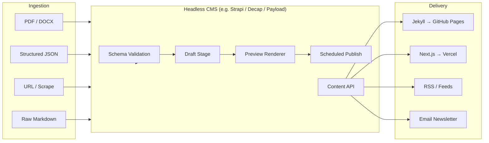
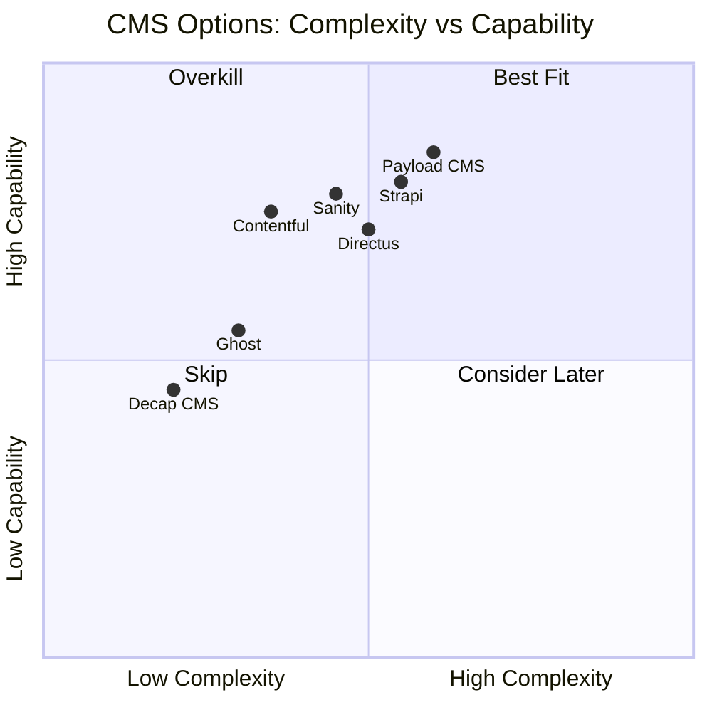
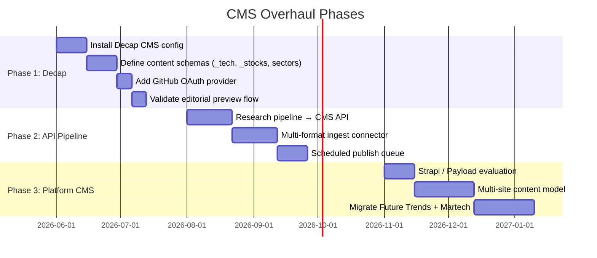
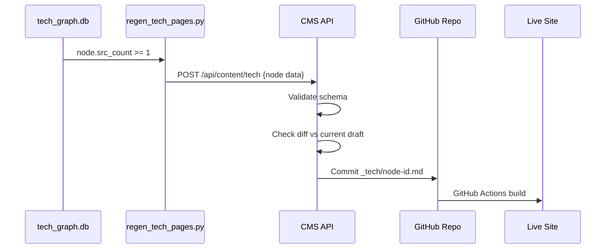
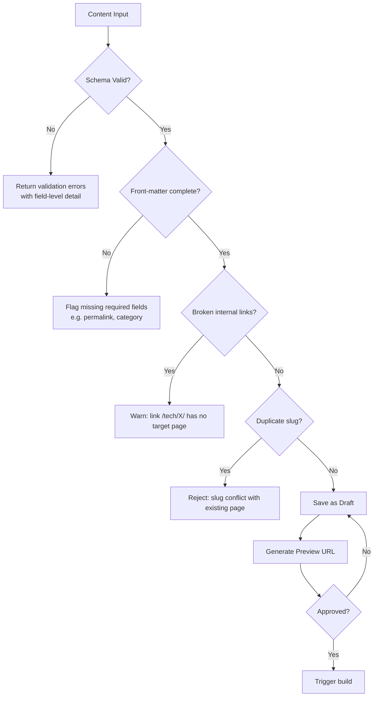

# Enhancement 01: CMS Overhaul

## Problem

Manual publishing via Jenkins is a bottleneck that does not scale. The current flow requires SSH access, a working Ruby/Jekyll environment, and manual `git push` to trigger a build. Errors surface late (post-push), file format support is limited to Markdown, and there is no editorial interface for non-technical contributors. As content becomes more granular: per-technology pages, per-stock pages, sector briefings: the publishing loop is the ceiling.

**Specific failure modes today:**
- A bad front-matter YAML silently breaks a page; only visible after deploy.
- No draft/preview mode: content is live or it does not exist.
- No multi-format ingestion (PDF, DOCX, structured JSON → page).
- No scheduled publishing.
- No diff/review step between DB change and live page.

---

## Full-Scale Vision

A headless CMS that acts as the editorial and publishing layer for the entire Martech platform: not just Future Trends. It decouples content authoring from the delivery layer, supports multiple front-ends (Jekyll, Next.js, mobile), validates content before publish, and exposes a GraphQL/REST API so the research pipeline can push content programmatically.



---

## Current State vs Target State

| Dimension | Current | Target |
|-----------|---------|--------|
| Authoring | Git + Markdown files | Web UI + API |
| Validation | None (post-push) | Pre-publish schema check |
| Preview | Local Jekyll serve | Hosted preview URL per draft |
| File formats | Markdown only | MD, JSON, PDF, DOCX, HTML |
| Publishing | Manual `git push` → Jenkins | One-click or API-triggered |
| Scheduling | None | Publish at UTC timestamp |
| Multi-site | Single repo | Multi-tenant via `site_id` |
| Rollback | Git revert | One-click version history |

---

## CMS Options Evaluation



**Recommended path:**
1. **Phase 1 (now):** Decap CMS: Git-backend, zero infra, drops directly into the existing Jekyll/GitHub Pages setup. Adds a web UI over the same Markdown files. No migration required.
2. **Phase 2 (platform scale):** Strapi or Payload CMS: self-hosted, full REST+GraphQL API, multi-site content types, role-based access. Migrates to a VPS alongside the domain migration.

---

## Phased Implementation



### Phase 1: Decap CMS (Quick Win)

Decap CMS (formerly Netlify CMS) is a React SPA that commits directly to GitHub. Install is a single HTML file + config YAML.

```yaml
# /admin/config.yml: Decap CMS schema example
backend:
  name: github
  repo: mengliang10/future
  branch: main

media_folder: assets/images
public_folder: /assets/images

collections:
  - name: tech
    label: Tech Nodes
    folder: _tech
    create: true
    slug: "{{slug}}"
    fields:
      - { label: Title, name: title, widget: string }
      - { label: Category, name: category, widget: string }
      - { label: Stage, name: stage, widget: select, options: [mass_production, early_commercial, pilot, proof_of_concept, basic_research, prototype] }
      - { label: Confidence Label, name: confidence_label, widget: string }
      - { label: Horizon, name: horizon, widget: string }
      - { label: Body, name: body, widget: markdown }
```

### Phase 2: Research Pipeline → CMS API

The existing Python research pipeline writes directly to `_tech/*.md` files. In Phase 2 it instead `POST`s to the CMS API, which handles validation, versioning, and publish scheduling.



---

## Error Checking Architecture



---

## Success Metrics

| Metric | Baseline | Target |
|--------|----------|--------|
| Time from DB update to live page | ~15 min (manual) | <2 min (automated) |
| Publishing errors caught pre-deploy | 0% | >95% |
| Content formats supported | 1 (Markdown) | 5+ |
| Non-technical contributors able to publish | 0 | Yes |
| Sites on same CMS | 1 | 3+ |

---

## Open Questions

- Decap CMS requires GitHub OAuth: does the org allow that app installation?
- Strapi self-host: VPS cost vs Strapi Cloud pricing at platform scale?
- Should the research pipeline remain a direct file writer in Phase 1, or go through CMS API from day one?
