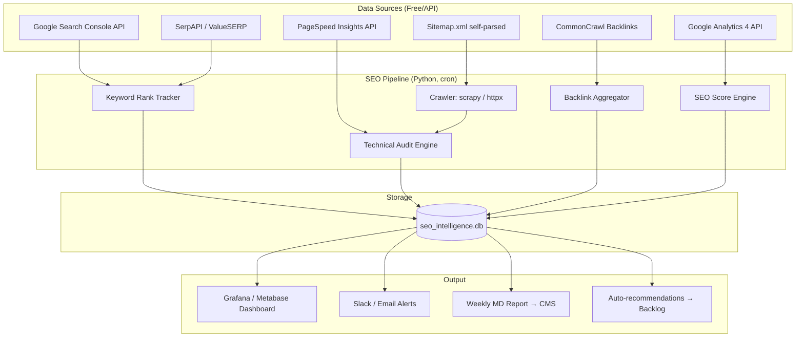
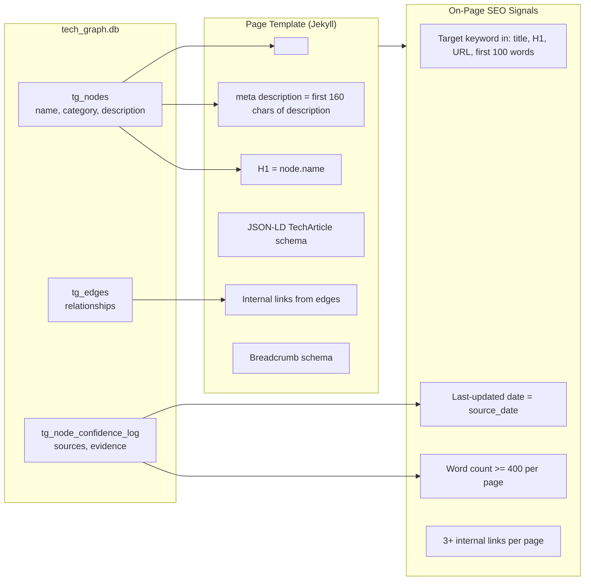
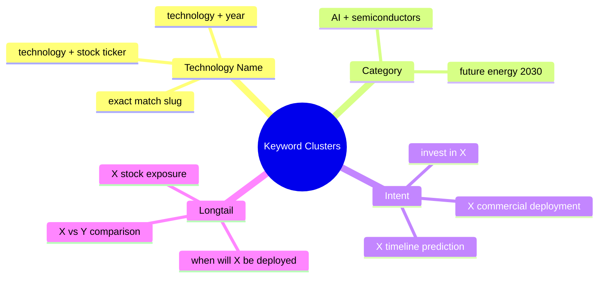
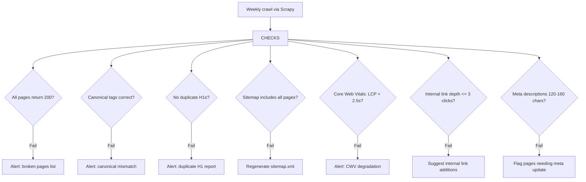

# Enhancement 02: SEO Stack (Without SemRush)

## Problem

SemRush costs $140–$450/month per user and is designed for single-site, human-operated workflows. At Martech platform scale: multiple sites, programmatic content, automated publishing: a per-seat SaaS tool is the wrong model. The goal is an owned, automated SEO stack that costs near-zero in licensing, integrates with the research pipeline, and generates actionable signals without manual intervention.

---

## Full-Scale Vision

A self-hosted SEO intelligence layer that monitors keyword rankings, crawl health, backlink growth, and Core Web Vitals across every property on the platform. It runs on a cron schedule, writes results to a central SQLite/Postgres DB, and surfaces alerts and dashboards without any proprietary SaaS dependency.



---

## Tool Stack (Zero-License)

| Function | SemRush Equivalent | OSS / Free Alternative | Cost |
|----------|--------------------|------------------------|------|
| Keyword rankings | Position Tracking | Google Search Console API + SerpAPI | Free / $50/mo |
| Site crawl | Site Audit | Scrapy + custom audit script | Free |
| Backlinks | Backlink Analytics | Ahrefs Webmaster Tools (free tier) + OpenLinkProfiler | Free |
| Core Web Vitals | Site Audit | PageSpeed Insights API (Google) | Free |
| Keyword research | Keyword Magic Tool | Google Keyword Planner API + DataForSEO | Free / ~$10/mo |
| Competitor analysis | Traffic Analytics | SimilarWeb free + manual GSC comparison | Free |
| Rank tracking | Position Tracking | SerpAPI (100 free/day) or custom SERP scraper | Free–$50/mo |

**Total estimated cost: $0–$60/month vs $140–$450/month for SemRush.**

---

## SEO Architecture for Programmatic Content

The Future Trends site generates content programmatically from a DB. This requires a different SEO model than hand-written content: optimisation must be baked into the generation templates, not applied manually post-publish.



### JSON-LD Schema for Tech Node Pages

Each `_tech/*.md` page should emit structured data to help both Google and AI search engines understand the content type:

```json
{
  "@context": "https://schema.org",
  "@type": "TechArticle",
  "headline": "{{ page.title }}",
  "description": "{{ page.subtitle }}",
  "dateModified": "{{ page.date }}",
  "author": { "@type": "Organization", "name": "Future Trends" },
  "about": {
    "@type": "Thing",
    "name": "{{ page.title }}",
    "description": "{{ page.subtitle }}"
  },
  "keywords": "{{ page.category }}, {{ page.stage }}, {{ page.horizon }}"
}
```

---

## Keyword Strategy for Programmatic Pages



**Targeting principle:** Each page targets one primary keyword (the technology name) plus 3–5 longtail variants derived from `est_year_mode`, `category`, and linked tickers. These are injected automatically by the template: no manual keyword assignment needed.

---

## Technical SEO Checklist (Automated)



---

## Phased Implementation

| Phase | Deliverable | Effort |
|-------|-------------|--------|
| 1 | GSC API integration → weekly rank pull to DB | 1 week |
| 2 | JSON-LD schema injection into Jekyll templates | 2 days |
| 3 | Automated sitemap.xml + robots.txt generator | 2 days |
| 4 | PageSpeed Insights weekly crawl → DB | 1 week |
| 5 | Keyword clustering script from GSC query data | 2 weeks |
| 6 | Grafana SEO dashboard | 1 week |
| 7 | SerpAPI rank tracker for top 50 target keywords | 1 week |

---

## Success Metrics

| Metric | Baseline | 6-Month Target |
|--------|----------|----------------|
| GSC impressions / month | Unknown | +200% |
| Pages indexed | Unknown | >95% of tech pages |
| Average position for technology keywords | Unknown | Top 20 |
| Core Web Vitals: LCP | Unknown | <2.5s |
| SEO tooling cost/month | $0 (no tooling) | <$60 |
| Time to detect SEO regression | Never | <24 hours |

---

## Open Questions

- SerpAPI free tier is 100 searches/day: sufficient for monitoring 50 keywords; need upgrade at scale.
- Should keyword research use Google Ads API (requires active ad account) or DataForSEO as fallback?
- At platform scale (10+ sites), does it make sense to self-host an open-source rank tracker like NightWatch alternative or SerpYacht?
