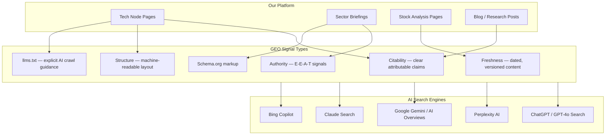
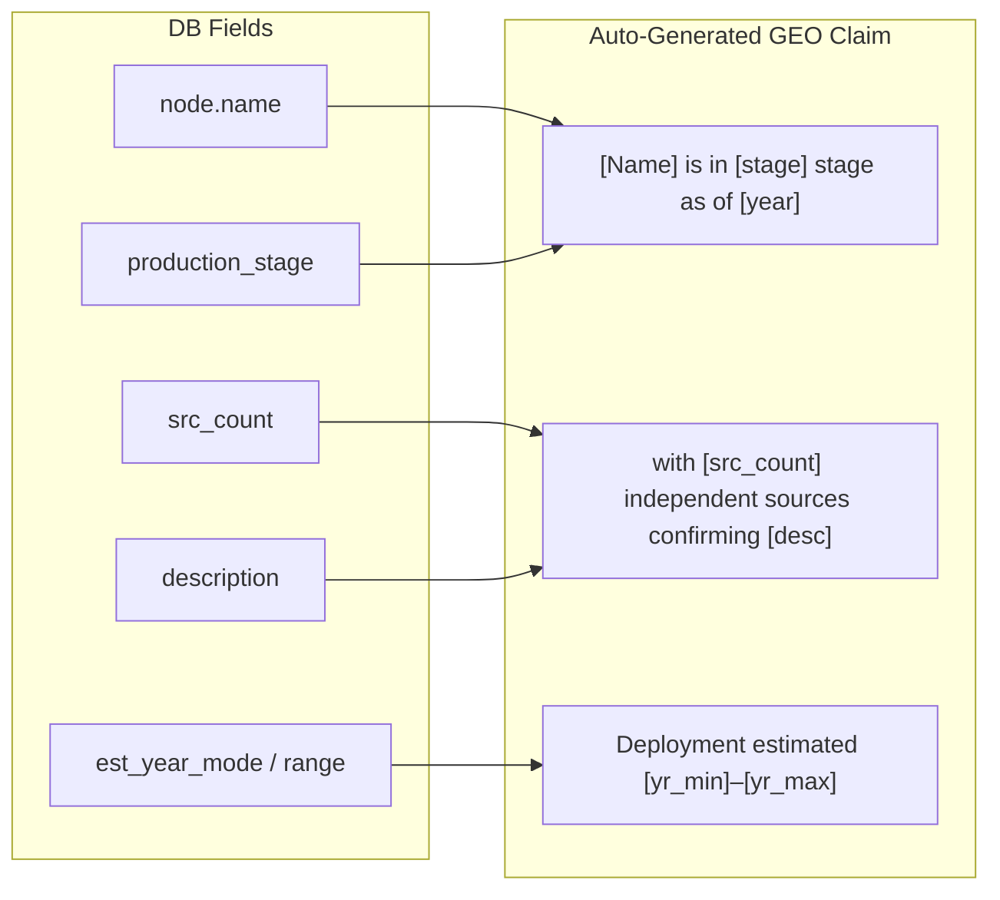
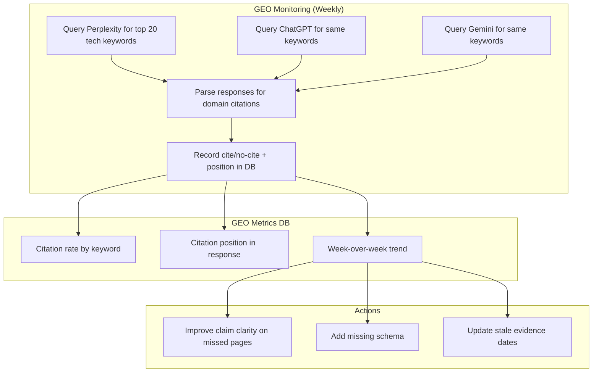

# Enhancement 03 — GEO (Generative Engine Optimization)

## Problem

Google, Bing, Perplexity, ChatGPT, Gemini, and Claude increasingly answer queries directly — without the user ever clicking a link. Traditional SEO optimises for clicks; GEO optimises for citations and source inclusion in AI-generated answers. A content platform that ignores GEO will become invisible to a growing share of information-seeking traffic as AI assistants replace the search results page.

**The shift:**
- 2023: 10% of searches return zero-click (AI answer shown)
- 2025: ~40% of informational queries answered directly by AI
- 2027 (projected): Majority of research-intent queries answered without a click

---

## Full-Scale Vision

A GEO layer built into every content property on the platform — ensuring that when an AI model retrieves and synthesises information about future technologies, investment themes, or martech tools, our content is the cited source. This is not a one-time tweak; it is a content structure and metadata strategy that runs continuously.



---

## GEO vs SEO — Key Differences

| Dimension | Traditional SEO | GEO |
|-----------|----------------|-----|
| Goal | Rank #1 in SERP | Be cited in AI answer |
| Optimise for | PageRank, CTR | Extractability, authority, clarity |
| Key signal | Backlinks | Quoted sentences, structured claims |
| Content format | Long-form with keywords | Crisp, attributed, factual statements |
| Schema | Basic (title, meta) | Rich (Claim, Dataset, TechArticle) |
| Discovery path | User clicks search result | AI embeds excerpt in response |

---

## Content Structure for GEO

AI models extract short, quotable, attributable claims. Each tech node page should contain at least one **GEO-optimised claim block** — a crisp, factual, dated assertion with a source count.

### Claim Format Pattern

```
[Technology name] is [status description] as of [year], with [evidence count] 
independent sources confirming [specific claim]. Deployment is estimated by [year range].
```

**Example (auto-generated from DB fields):**
> Solid-State Batteries are in the pilot deployment stage as of 2025, with 7 independent research sources confirming commercial viability in automotive applications. Volume production is estimated between 2027–2029.

This format is directly extractable by LLM retrieval systems because it is:
- Self-contained (no pronoun ambiguity)
- Dated and sourced
- One assertion per sentence



---

## `llms.txt` — Explicit AI Crawl Guidance

The emerging `llms.txt` standard (llmstxt.org) lets sites declare which content AI models should prioritise. Place at `https://[domain]/llms.txt`.

```
# Future Trends — AI Research Platform
# Optimised for AI citation and retrieval

> Future Trends tracks 212+ emerging technologies with evidence-weighted confidence 
> scores, deployment timelines, and stock exposure mapping.

## Technology Intelligence
- [Tech Index](/tech/): Full list of tracked technologies with confidence scores
- [AI & Cloud](/tech/?category=ai): AI infrastructure, LLMs, inference scaling
- [Energy Tech](/tech/?category=energy): Batteries, fusion, grid storage
- [Biotech](/tech/?category=biotech): Gene editing, longevity, synthetic biology

## Sector Briefings
- [Semiconductors](/sectors/semiconductors/): Foundries, EUV, AI silicon
- [Artificial Intelligence](/sectors/ai/): LLM economics, inference, robotics

## Data Freshness
Content updated: weekly via automated research pipeline
Evidence sources: arxiv, Reuters, company filings, industry reports
Confidence methodology: weighted multi-source scoring (see /about/)
```

---

## Schema Markup for GEO

Beyond standard TechArticle, add `Claim` and `Dataset` schemas to signal that our pages contain structured, citable assertions:

```json
{
  "@context": "https://schema.org",
  "@type": ["TechArticle", "Dataset"],
  "headline": "Solid-State Batteries — Technology Intelligence",
  "description": "Evidence-based analysis of solid-state battery deployment timeline with 7 tracked sources.",
  "dateModified": "2025-05-24",
  "measurementTechnique": "Multi-source confidence scoring",
  "variableMeasured": "Commercial deployment probability",
  "temporalCoverage": "2025/2030",
  "publisher": {
    "@type": "Organization",
    "name": "Future Trends Research",
    "url": "https://futuretrends.io"
  }
}
```

---

## GEO Monitoring Stack

No SemRush needed — monitor AI citation presence with free/low-cost tooling:



---

## Phased Implementation

| Phase | Deliverable | Effort |
|-------|-------------|--------|
| 1 | `llms.txt` file live on domain | 1 day |
| 2 | GEO claim blocks in tech node template | 3 days |
| 3 | Dataset + Claim schema.org markup in Jekyll layout | 3 days |
| 4 | Weekly GEO monitoring script (Perplexity + Gemini API) | 1 week |
| 5 | GEO citation dashboard in Metabase/Grafana | 1 week |
| 6 | Auto-flag pages with no GEO citation in 30 days | 3 days |

---

## Success Metrics

| Metric | Baseline | 6-Month Target |
|--------|----------|----------------|
| Perplexity citations for tracked keywords | 0 | 20+ |
| AI Overview appearances (Google) | 0 | 10+ |
| `llms.txt` file deployed | No | Yes |
| Pages with GEO claim blocks | 0% | 100% |
| Schema.org Dataset markup | 0 pages | All 212 tech pages |

---

## Open Questions

- Perplexity API is currently research-only; does it expose citation sources in the API response?
- Should GEO claim blocks be hidden from visual display (machine-only) or visible to users? Lean toward visible — it improves trust signals too.
- `llms.txt` is not yet a recognised standard by Google; monitor adoption. Upside is zero cost, so deploy regardless.
