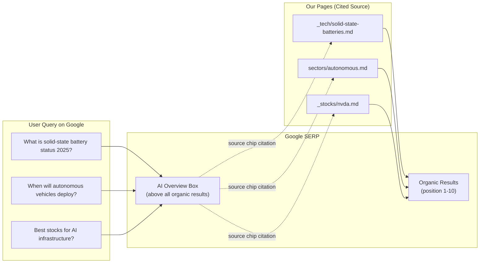
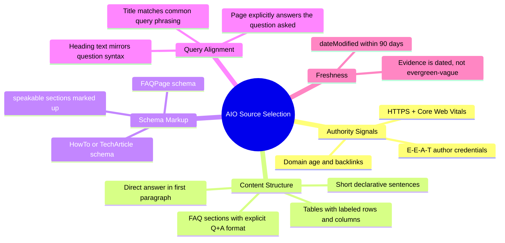
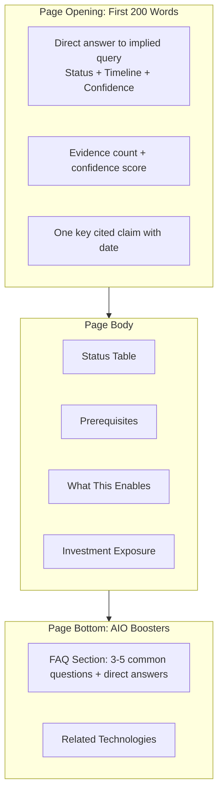
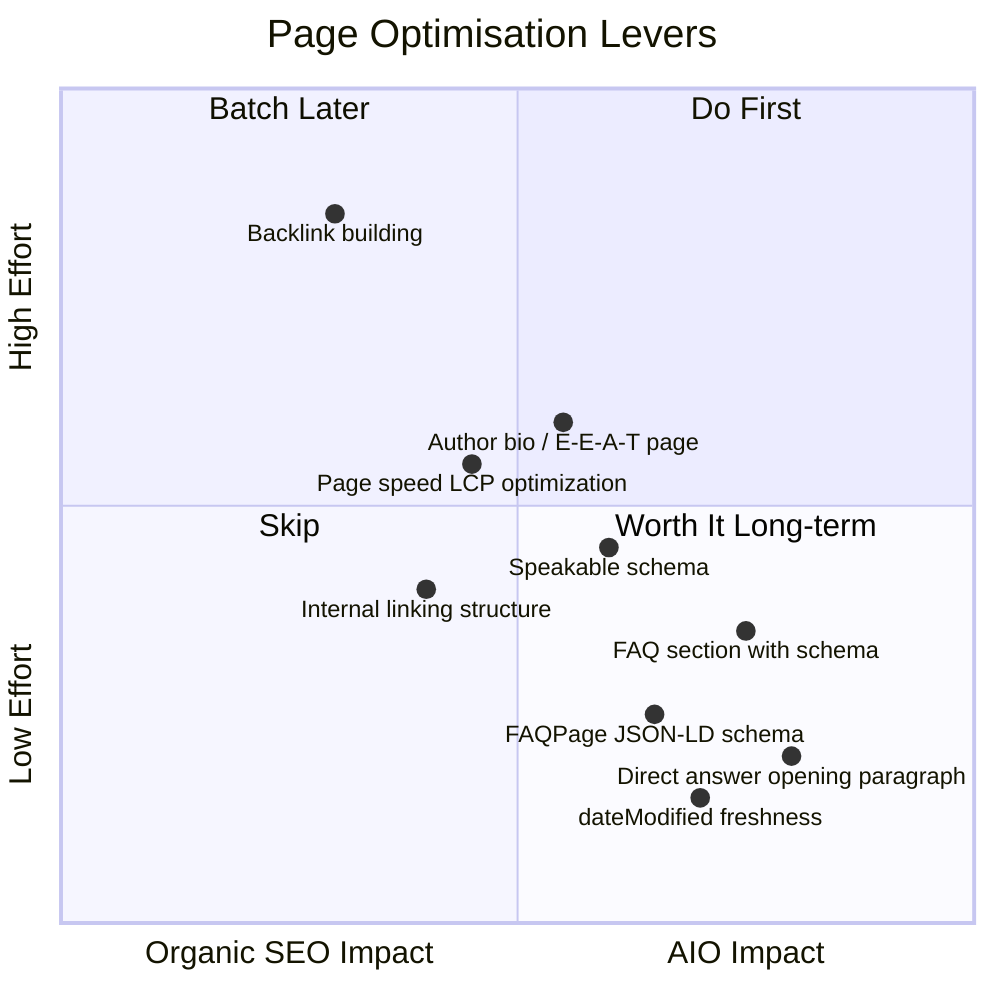
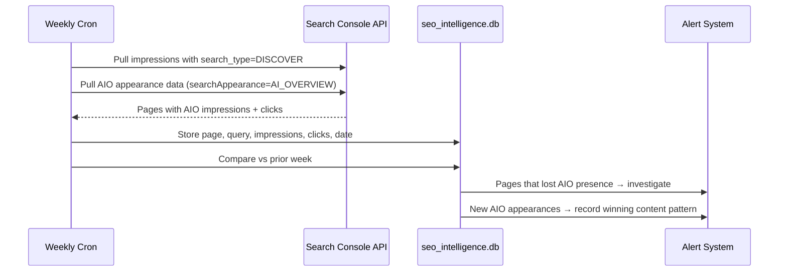

# Enhancement 04: AIO (AI Overview Optimization)

## Problem

Google's AI Overviews (formerly Search Generative Experience, SGE) now appear for roughly 30–40% of informational queries in the US. An AI Overview occupies the top of the SERP above all organic results, and the user often gets the answer without scrolling. Pages that feed AI Overviews receive a source chip citation: a different conversion mechanism than a ranked blue link. Pages not cited in AIO become invisible for that query class, regardless of their organic rank.

AIO differs from GEO (Enhancement 03) in a critical way: **GEO targets third-party AI assistants like ChatGPT/Perplexity; AIO targets Google's own SERP experience.** Both must be addressed, but with different signals and tactics.

---

## Full-Scale Vision

Every content page on the platform is structured and maintained so that Google's AI system can extract, summarise, and cite it in AI Overviews. This requires content architecture that favours directness and authority over engagement-bait writing, combined with structured data that signals the page's fitness for summarisation.



---

## How Google AI Overviews Select Sources

Google has not published a specification, but analysis of AI Overview citations points to five consistent signals:



---

## Content Architecture Changes

### 1. Direct-Answer Opening Paragraph

Google AIO prefers pages where the first 150 words directly answer the most likely query. Current tech node pages lead with the description. They should lead with a direct-answer summary block:

**Current:**
> Solid-State Batteries are an energy storage technology using solid electrolytes instead of liquid...

**AIO-Optimised:**
> **Solid-State Batteries: Current Status (2025)**: Commercial pilot deployments are underway at Toyota and CATL as of 2025. Volume production is estimated for 2027–2029. Our research database tracks 7 independent sources confirming pilot-stage readiness, with confidence score +0.62 (Researching).



### 2. FAQ Section (Auto-Generated from DB Fields)

Each tech node page should auto-generate a FAQ section from DB fields. This maps directly to Google's `FAQPage` schema and is a high-signal AIO source trigger.

| Question Template | DB Field Used |
|-------------------|---------------|
| What is [name]? | description |
| What stage is [name] at? | production_stage + STAGE_TEXT |
| When will [name] be commercially available? | est_year_mode + est_year_range |
| How confident is the [name] timeline? | confidence + conf_label |
| Which companies are investing in [name]? | tickers + stocks |
| What does [name] enable? | edges (ENABLES type) |
| What does [name] require? | edges (REQUIRES type) |

```liquid
 Jekyll template fragment: FAQ section 
<section class="faq-section" itemscope itemtype="https://schema.org/FAQPage">
  <h2>Frequently Asked Questions</h2>

  <div itemscope itemprop="mainEntity" itemtype="https://schema.org/Question">
    <h3 itemprop="name">What is {{ page.title }}?</h3>
    <div itemscope itemprop="acceptedAnswer" itemtype="https://schema.org/Answer">
      <p itemprop="text">{{ page.subtitle }}</p>
    </div>
  </div>

  <div itemscope itemprop="mainEntity" itemtype="https://schema.org/Question">
    <h3 itemprop="name">When will {{ page.title }} be commercially deployed?</h3>
    <div itemscope itemprop="acceptedAnswer" itemtype="https://schema.org/Answer">
      <p itemprop="text">
        
          Estimated commercial deployment: {{ page.est_year }}
          (range: {{ page.est_year_range }}).
        
          Timeline is not yet determined: technology is in early research phase.
        
      </p>
    </div>
  </div>
</section>
```

---

## AIO vs Organic Rank: Dual Optimisation

A page can rank #1 organically and still not be cited in the AI Overview, or vice versa. Optimise for both simultaneously with different levers:



---

## `speakable` Schema Markup

Google's `speakable` property flags specific sections of a page as AIO-ready summaries. This is a direct signal to the AI Overview system:

```json
{
  "@context": "https://schema.org/",
  "@type": "TechArticle",
  "speakable": {
    "@type": "SpeakableSpecification",
    "cssSelector": [".aio-summary", ".status-table", ".faq-section"]
  }
}
```

Requires adding a `.aio-summary` div to each tech node page containing the direct-answer opening paragraph.

---

## AIO Monitoring

Track whether our pages appear in AI Overviews using the Search Console API (Google now exposes AIO impressions/clicks) plus manual spot checks:



---

## Phased Implementation

| Phase | Deliverable | Effort |
|-------|-------------|--------|
| 1 | Direct-answer summary block in Jekyll layout | 2 days |
| 2 | Auto-generated FAQ section from DB fields | 3 days |
| 3 | FAQPage + speakable JSON-LD in template | 2 days |
| 4 | `dateModified` header injection from `source_date` | 1 day |
| 5 | GSC AIO monitoring integration | 1 week |
| 6 | AIO appearance tracking dashboard | 1 week |

---

## Success Metrics

| Metric | Baseline | 6-Month Target |
|--------|----------|----------------|
| Pages with direct-answer opening | 0% | 100% |
| Pages with FAQ section | 0% | 100% |
| AIO impressions/month (GSC) | 0 | 500+ |
| AIO click-through rate | N/A | >5% |
| Pages cited in AI Overviews | 0 | 30+ |

---

## Open Questions

- Google has not made the AIO source selection algorithm public: all signals above are inferred from pattern analysis. Monitor `searchAppearance` field in GSC as the authoritative signal.
- Is there a conflict between AIO optimization (brevity, direct answers) and depth-of-content SEO (longer pages rank better)? Resolution: put the direct answer first, then depth below the fold.
- Should the direct-answer summary block be visually styled (highlighted box) or invisible to readers? Styled is better: it increases dwell time and signals deliberate information architecture.
