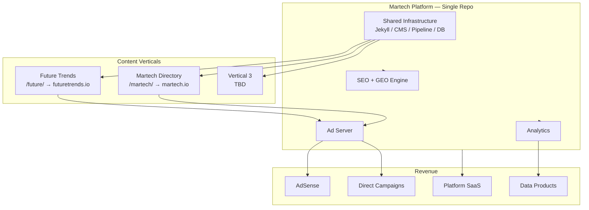
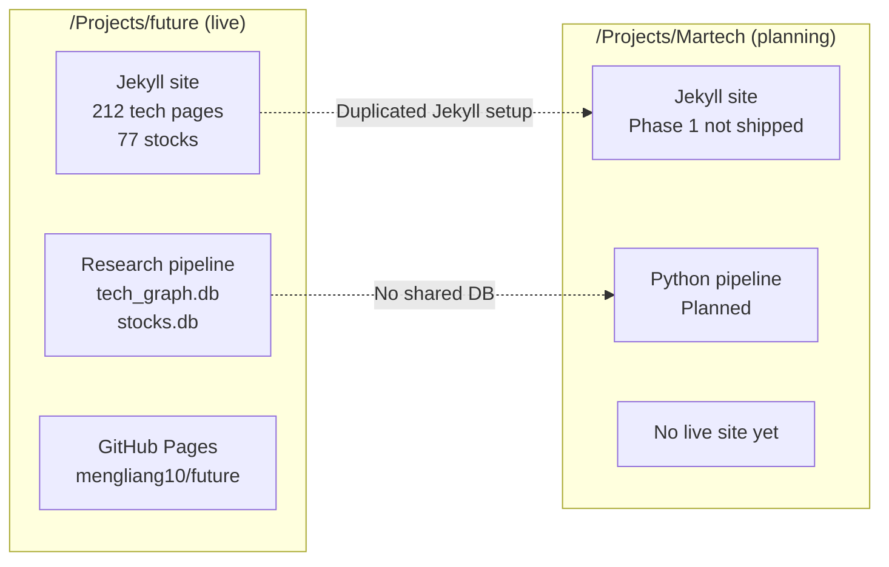
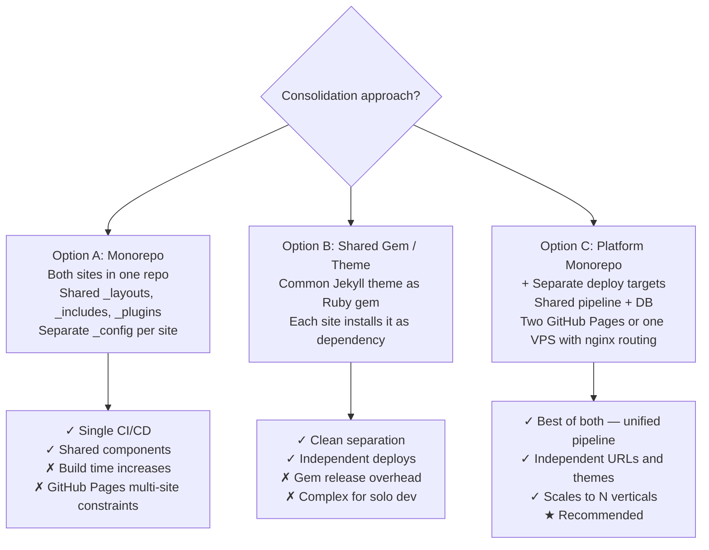
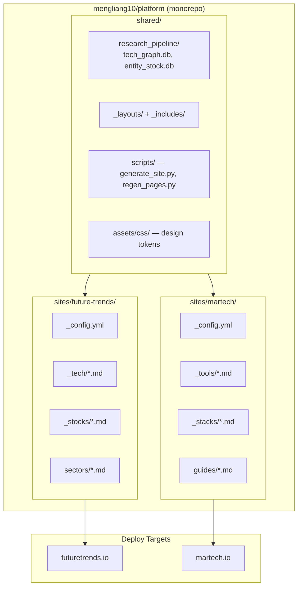
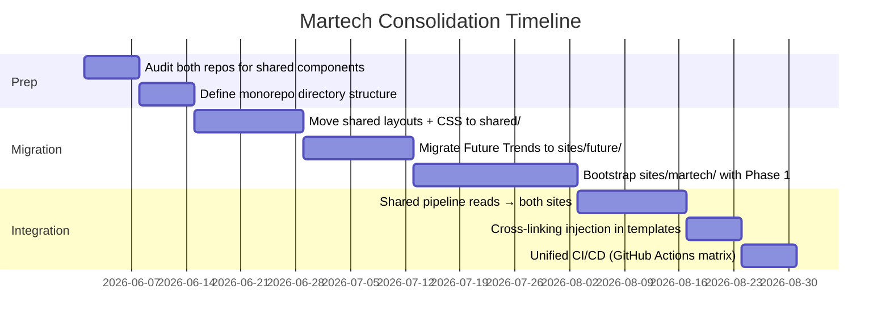

# Enhancement 05 — Martech Platform Consolidation

## Problem

Two projects currently exist in separate directories with separate repositories, Jekyll configurations, and development workflows:

- `/Projects/future/` — Future Trends site (live, 212 tech pages, research pipeline, stocks)
- `/Projects/Martech/` — Martech Directory platform (planning phase, Phase 1 not yet shipped)

They share: the same Jekyll stack, the same SQLite/Python research pipeline approach, the same target audience (investors, technologists, marketers), and the same eventual monetisation model. Running them as independent silos means duplicated infrastructure, split attention, and missed cross-linking opportunities. The consolidation decision is: **one platform, two (or more) content verticals**.

---

## Full-Scale Vision

A single Martech Platform that hosts multiple content verticals under one codebase, one CMS, one analytics stack, one ad server, and one domain. Each vertical (Future Trends, Martech Directory, and future additions) is a sub-site with its own URL path, design skin, and content pipeline — but shares all infrastructure.



---

## Current State — Two Separate Repos



**Pain points:**
- `_config.yml`, layouts, and CSS maintained in two places.
- Martech has a separate `REQUIREMENTS.md`, `DEVELOPMENT.md` — no shared backlog.
- No cross-linking between Future Trends tech nodes and Martech tool pages.
- Two separate CI/CD pipelines once Martech ships.

---

## Consolidation Options



**Recommendation: Option C** — shared pipeline and DB infrastructure in one repo, separate Jekyll configs deployed to separate paths or domains, unified via Nginx on a VPS (links to Enhancement 06 — Domain Migration).

---

## Target Architecture (Post-Consolidation)



---

## Cross-Linking Value

The highest immediate value of consolidation is bidirectional cross-linking:

| Future Trends Page | Links to Martech Page |
|--------------------|----------------------|
| /tech/marketing-ai-automation/ | /martech/tools/jasper-ai/, /martech/stacks/content-marketing/ |
| /tech/customer-data-platforms/ | /martech/tools/segment/, /martech/tools/rudderstack/ |
| /tech/programmatic-advertising/ | /martech/tools/gam/, /martech/stacks/adtech/ |
| /sectors/marketing/ | /martech/ (directory index) |

This creates a content flywheel: Future Trends attracts research-intent traffic → Martech Directory captures implementation-intent traffic → both monetise via ads and platform.

```mermaid
flowchart LR
    USER[Research User] -->|Searches: "CDP technology 2026"| FT[Future Trends\n/tech/customer-data-platforms/]
    FT -->|"See CDP tools →"| MT[Martech Directory\n/martech/tools/cdp/]
    MT -->|"Build your CDP stack →"| BUILDER[Stack Builder\nLead gen / SaaS]
    BUILDER -->|Conversion| REVENUE[Platform Revenue]
```

---

## Martech Project Status (Current)

From `DEVELOPMENT.md` review:

| Phase | Status | Key Deliverables |
|-------|--------|-----------------|
| 1 — Content Foundation | Planning | 100+ tool pages, directory |
| 2 — Stack Builder | Planning | Interactive builder, plan generator |
| 3 — Research Pipeline | Planning | Automated scraping → DB → YAML |
| 4 — Monetization | Future | Accounts, AI plans, payments |

**Recommendation:** Halt independent Martech development. Invest the Phase 1 effort into the consolidated platform repo. The Martech site ships under the unified platform infrastructure — no separate Jekyll config, no separate pipeline.

---

## Migration Plan



---

## Success Metrics

| Metric | Baseline | Target |
|--------|----------|--------|
| Separate repos to maintain | 2 | 1 |
| Shared layout components | 0 | 100% |
| Cross-links between verticals | 0 | 50+ |
| CI/CD pipelines | 1 (future only) | 1 (both sites) |
| Time to launch new vertical | Weeks | Days |

---

## Open Questions

- GitHub Pages supports only one Pages site per repo at the free tier — does consolidation require a move to a custom domain + VPS? (Yes — see Enhancement 06.)
- Should the research pipeline DB live in the shared monorepo or remain in `/Trading/Research/`? The Trading pipeline has broader scope; keep it separate but add a sync/export step to the platform repo.
- Martech tool data (tool names, pricing, integrations) is a different schema from tech node data — does a shared CMS accommodate both cleanly, or do they need separate collections?
