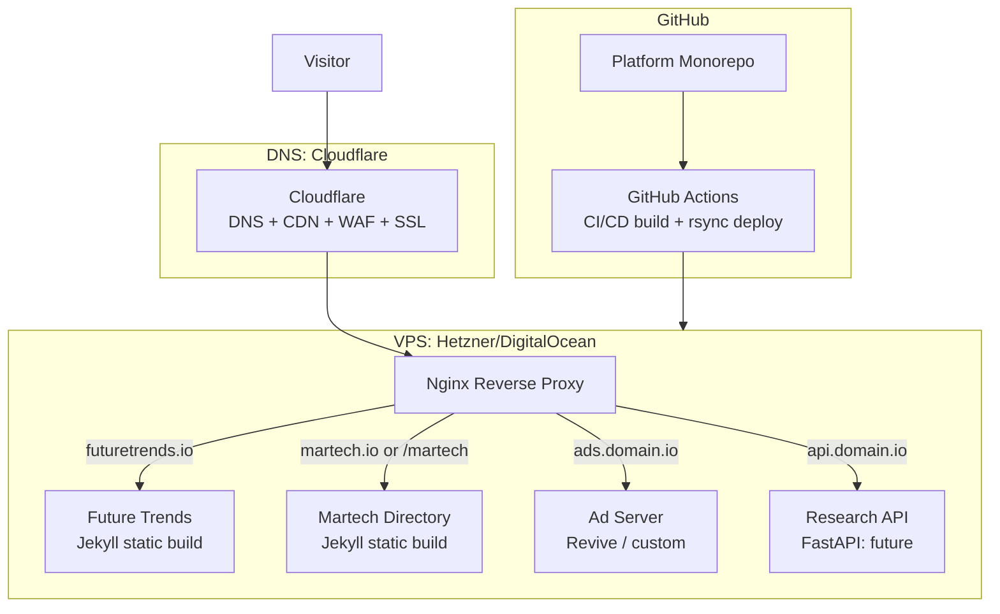
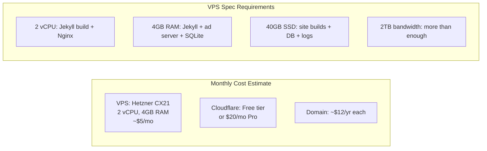
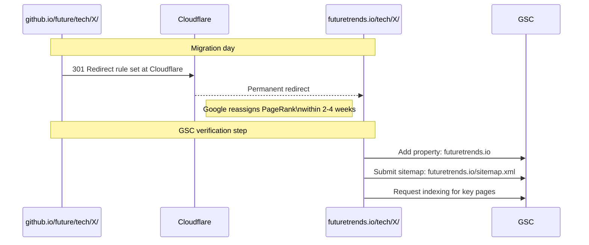
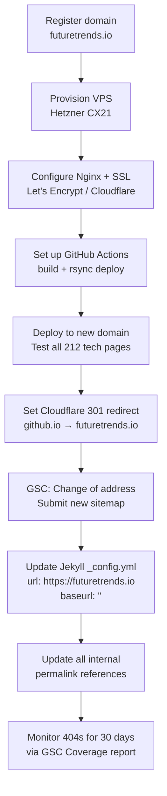

# Enhancement 06: Domain Migration

## Problem

GitHub Pages at `mengliang10.github.io/future` imposes structural constraints that become blocking at platform scale:

- **Path prefix required**: every URL carries `/future/` which conflicts with clean domain architecture.
- **One Pages site per repo**: multi-vertical consolidation (Enhancement 05) requires either separate repos or a custom domain host.
- **No server-side logic**: no redirects beyond basic 404, no A/B routing, no edge personalisation.
- **GitHub controls uptime**: outages are outside our control and unannounced.
- **SEO signal dilution**: `github.io` domain carries its own authority; a custom domain builds authority for the property.
- **Ad server requirement**: building an ad server (Enhancement 08) requires a real server, not a static CDN.

---

## Full-Scale Vision

Own the domain. Host on a VPS behind Cloudflare. Serve multiple verticals (future-trends, martech, and others) from a single Nginx reverse proxy. Maintain static site generation (Jekyll) for performance, but gain the flexibility to add server-side components (FastAPI, Node) where needed.



---

## Domain Strategy

| Domain | Purpose | Priority |
|--------|---------|----------|
| `futuretrends.io` | Primary brand: tech intelligence | High |
| `futuretrendsintel.io` | Fallback if primary taken | Medium |
| `martech.io` | Martech directory brand | High (likely taken: check) |
| `martechplatform.io` | Fallback for Martech | Medium |
| `ads.futuretrends.io` | Ad server subdomain | Low (subdomain, free) |
| `api.futuretrends.io` | API subdomain | Low (subdomain, free) |

**Check availability and register domains before investing in SEO: domain authority accumulates from day of registration.**

---

## Infrastructure Stack



**Total infrastructure cost: ~$5–$25/month vs $0 on GitHub Pages.**
Justified by: multi-site hosting, ad server, server-side logic, custom domain SEO authority.

---

## Nginx Routing Configuration

```nginx
# /etc/nginx/sites-available/platform.conf

server {
    listen 443 ssl http2;
    server_name futuretrends.io www.futuretrends.io;

    root /var/www/future-trends/_site;
    index index.html;

    # Clean URLs: Jekyll generates them
    location / {
        try_files $uri $uri/ $uri.html =404;
    }

    # Cache static assets aggressively
    location ~* \.(js|css|png|jpg|svg|woff2)$ {
        expires 1y;
        add_header Cache-Control "public, immutable";
    }

    ssl_certificate /etc/letsencrypt/live/futuretrends.io/fullchain.pem;
    ssl_certificate_key /etc/letsencrypt/live/futuretrends.io/privkey.pem;
}

server {
    listen 443 ssl http2;
    server_name martech.io www.martech.io;
    root /var/www/martech/_site;
    # ... same pattern
}
```

---

## SEO Preservation During Migration

Migrating from `mengliang10.github.io/future/` to `futuretrends.io/` requires preserving all URL equity. Every existing URL must 301-redirect to the new canonical.



**Critical: Submit change of address in Google Search Console immediately after migration.**

### URL Mapping

| Old URL | New URL |
|---------|---------|
| `mengliang10.github.io/future/` | `futuretrends.io/` |
| `mengliang10.github.io/future/tech/solid-state-batteries/` | `futuretrends.io/tech/solid-state-batteries/` |
| `mengliang10.github.io/future/stocks/nvda/` | `futuretrends.io/stocks/nvda/` |
| `mengliang10.github.io/future/sectors/ai/` | `futuretrends.io/sectors/ai/` |

Path structure is preserved: only the domain and prefix change. Jekyll `permalink` values in front matter drop the `/future/` prefix. This is a one-line config change.

---

## CI/CD: GitHub Actions to VPS

Replace the current GitHub Pages build with a GitHub Actions workflow that builds Jekyll and rsyncs the `_site/` output to the VPS:

```yaml
# .github/workflows/deploy.yml
name: Build and Deploy

on:
  push:
    branches: [main]

jobs:
  deploy:
    runs-on: ubuntu-latest
    steps:
      - uses: actions/checkout@v4

      - name: Setup Ruby
        uses: ruby/setup-ruby@v1
        with:
          ruby-version: 3.2
          bundler-cache: true

      - name: Build Future Trends
        run: bundle exec jekyll build --source sites/future-trends --destination _site/future
        env:
          JEKYLL_ENV: production

      - name: Deploy via rsync
        uses: easingthemes/ssh-deploy@v4
        with:
          SSH_PRIVATE_KEY: ${{ secrets.VPS_SSH_KEY }}
          REMOTE_HOST: ${{ secrets.VPS_HOST }}
          REMOTE_USER: deploy
          SOURCE: _site/future/
          TARGET: /var/www/future-trends/_site/
```

---

## Migration Checklist



---

## Phased Implementation

| Phase | Deliverable | Effort |
|-------|-------------|--------|
| 1 | Register domain(s) | 1 day |
| 2 | Provision VPS + Nginx + SSL | 2 days |
| 3 | GitHub Actions CI/CD pipeline | 2 days |
| 4 | Test deploy to new domain (no redirect yet) | 1 day |
| 5 | Go-live: enable 301 redirects | 1 day |
| 6 | GSC change of address + sitemap | 1 day |
| 7 | Monitor rankings and 404s for 30 days | Ongoing |

---

## Success Metrics

| Metric | Baseline | 30-Day Post-Migration Target |
|--------|----------|------------------------------|
| Domain authority | 0 (github.io sub) | Building from day 1 |
| 404 errors post-migration | N/A | 0 |
| GSC coverage drop | N/A | <5% pages lost |
| Page load time | ~1.2s (GitHub CDN) | <1.0s (Cloudflare CDN) |
| Multi-site capability | 1 | 2+ |

---

## Open Questions

- `martech.io` is almost certainly registered: run a WHOIS check. If taken, consider `martechplatform.io` or subdomains off `futuretrends.io`.
- Should both sites share one VPS or separate? Start with one VPS, add more as traffic requires.
- Cloudflare free tier provides SSL and DDoS protection; does the Pro tier ($20/mo) add meaningful value at current traffic levels? Probably not yet.
- Keep GitHub Pages as a free staging environment? Deploy main branch to VPS, preview branches to GitHub Pages.
