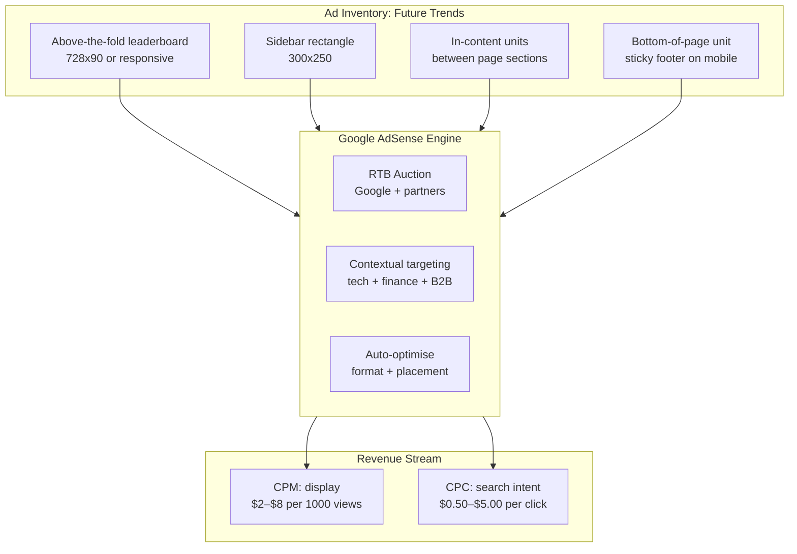
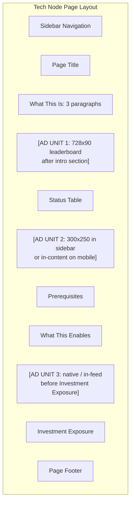
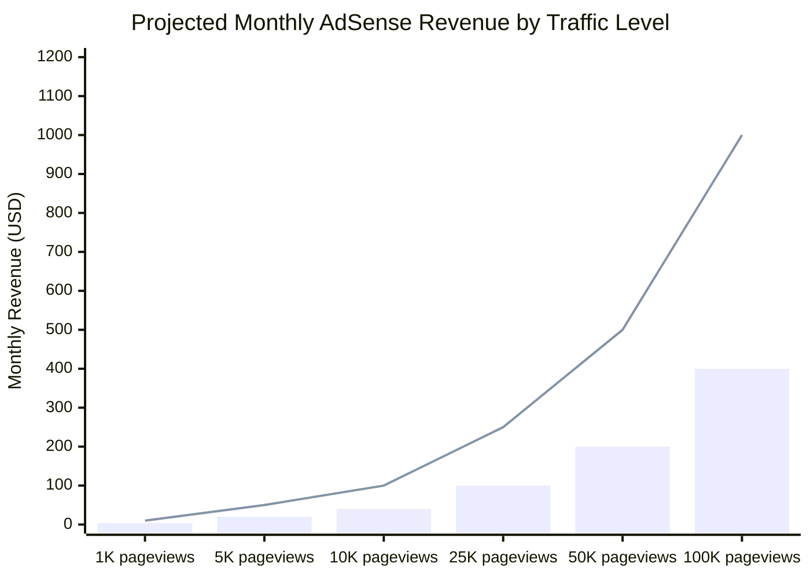
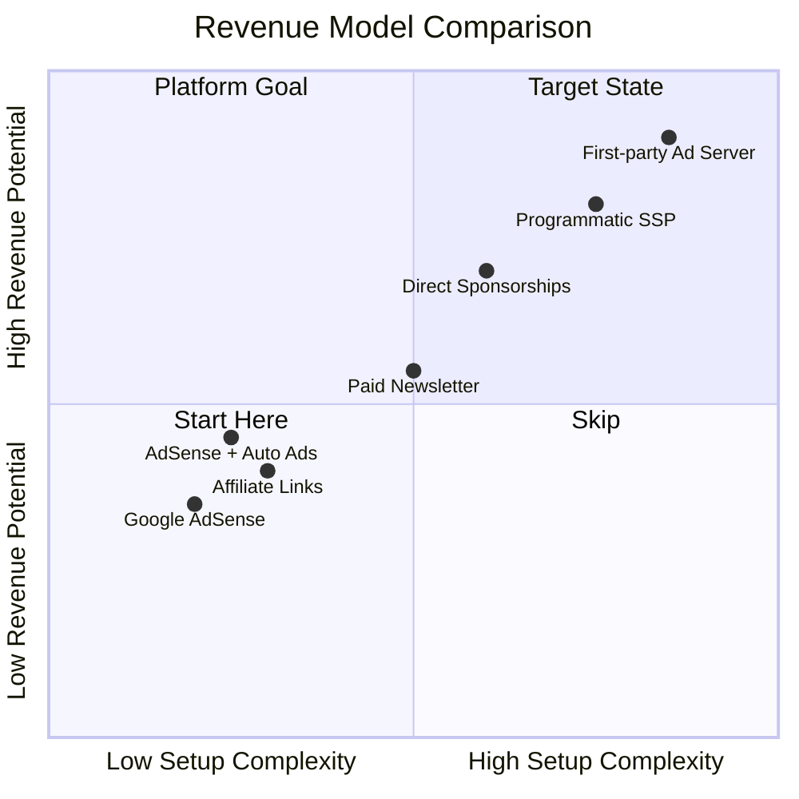

# Enhancement 07: Monetization: Google AdSense

## Problem

The Future Trends site generates valuable research-grade content and is growing to 212+ technology intelligence pages. It currently earns $0. Google AdSense is the fastest path to passive monetisation for an informational content site: no sales team, no deal management, no minimum traffic threshold (though quality content approval is required). The question is not whether to enable it, but how to implement it in a way that maximises revenue without degrading user experience or content credibility.

---

## Full-Scale Vision

AdSense as the baseline monetisation layer across all platform properties: the revenue floor. It runs automatically, requires no account management, and provides a CPM/CPC signal about which content attracts commercial-intent audiences. That signal is then used to prioritise content investment and to attract direct advertisers at higher CPMs (see Enhancement 08: Ad Server).



---

## AdSense Approval Requirements

Google reviews sites manually before approval. Key requirements:

| Requirement | Current Status | Action Needed |
|-------------|----------------|---------------|
| Original, high-quality content | ✓ 212 tech pages with evidence data | None |
| Clear navigation | ✓ Sidebar nav | None |
| Privacy policy page | ✗ Missing | Create /privacy/ page |
| About page | Partial: /about/ exists? | Verify + expand |
| No adult/prohibited content | ✓ | None |
| Custom domain (recommended) | ✗ GitHub Pages URL | See Enhancement 06 |
| Sufficient content volume | ✓ 212+ pages | None |
| Minimum traffic (soft) | Unknown | Submit after domain migration |

**Recommendation:** Apply for AdSense after domain migration (Enhancement 06) and after creating a privacy policy page. Custom domains receive faster approvals and command higher CPMs.

---

## Ad Unit Strategy



**Placement principles:**
- Never above the H1: Google penalises top-heavy ad layouts.
- At least one full section of content between ad units.
- Sidebar ads only on desktop: collapse on mobile.
- Maximum 3 ad units per page (Google allows more, but diminishing returns past 3 on sub-1000-word pages).

---

## Jekyll Implementation

AdSense is a JavaScript snippet: inject via Jekyll include so it's managed in one place:

```html
 _includes/adsense.html 

<script async src="https://pagead2.googlesyndication.com/pagead/js/adsbygoogle.js?client=ca-pub-XXXXXXXXXXXXXXXX"
     crossorigin="anonymous"></script>

```

```html
 In-content ad unit include 

<div class="ad-unit ad-unit--in-content" aria-label="Advertisement">
  <ins class="adsbygoogle"
       style="display:block"
       data-ad-client="ca-pub-XXXXXXXXXXXXXXXX"
       data-ad-slot="XXXXXXXXXX"
       data-ad-format="auto"
       data-full-width-responsive="true"></ins>
  <script>(adsbygoogle = window.adsbygoogle || []).push({});</script>
</div>

```

**Only render in `production` environment**: keeps local development clean and avoids invalid click issues.

---

## Revenue Projection

AdSense CPMs for finance/tech/B2B content vary widely. Conservative model based on industry benchmarks:



*Bar = conservative ($4 effective CPM). Line = optimistic ($10 eCPM, finance/B2B vertical premium).*

**At current traffic (unknown baseline):** Even 5,000 pageviews/month yields $20–$50/month passively. At 50K pageviews: achievable with domain migration + SEO/GEO enhancements: $200–$500/month.

---

## AdSense vs Direct Ads Comparison



**Strategy:** Start with AdSense (bottom-left, low effort). Use AdSense revenue data to identify high-value content categories. Pitch direct sponsorships to finance/tech companies in those categories at 3–5x AdSense CPM. Layer in the ad server (Enhancement 08) as direct deal volume justifies it.

---

## Privacy Policy Requirement

AdSense requires a privacy policy. Minimum content for compliance:

```markdown
## Privacy Policy

**Data collected:** This site uses Google AdSense to display advertisements. 
Google may use cookies to serve ads based on your prior visits to this or other 
websites. You may opt out via [Google's Ad Settings](https://adssettings.google.com).

**Analytics:** We use Google Analytics 4 to understand site usage. No personally 
identifiable information is collected.

**No data sale:** We do not sell personal data to third parties.

Last updated: [date]
```

---

## Phased Implementation

| Phase | Deliverable | Effort |
|-------|-------------|--------|
| 1 | Create /privacy/ and /about/ pages | 1 day |
| 2 | Register AdSense account, submit site | 1 day |
| 3 | Add `_includes/adsense.html` snippet | 1 day |
| 4 | Add 3 ad unit placements to tech_node layout | 2 days |
| 5 | Add ad units to sector + stock page layouts | 2 days |
| 6 | Wait for AdSense approval (1–14 days) |: |
| 7 | Monitor performance dashboard weekly | Ongoing |

---

## Success Metrics

| Metric | Baseline | 3-Month Target |
|--------|----------|----------------|
| AdSense account approved | No | Yes |
| Ad units live (pages) | 0 | 200+ |
| Monthly pageviews | Unknown | 10,000+ |
| Monthly AdSense revenue | $0 | $40–$100 |
| Effective CPM | N/A | $4–$10 |
| Pages per session | Unknown | >2.0 |

---

## Open Questions

- Does AdSense approval require a custom domain, or will `mengliang10.github.io` qualify? GitHub Pages domains are approved but custom domains get better CPMs.
- Should Auto Ads be enabled (Google places ads automatically anywhere) vs manual placement control? Start with manual: preserves editorial layout control. Enable Auto Ads after baseline is established.
- Content credibility concern: financial/investment content with ads: does AdSense serve relevant ads (finance tools, brokers) or irrelevant ones? Finance content typically attracts high-CPM finance advertisers.
