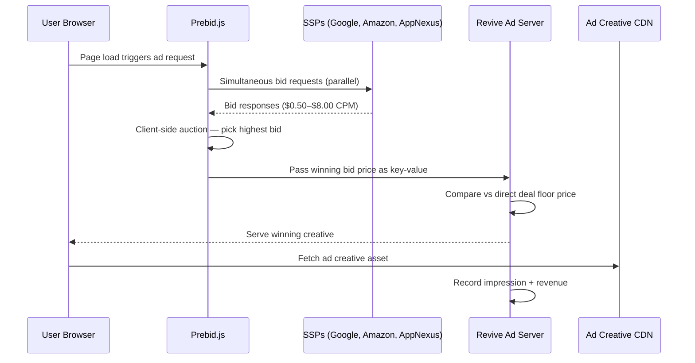
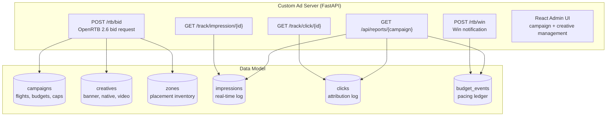
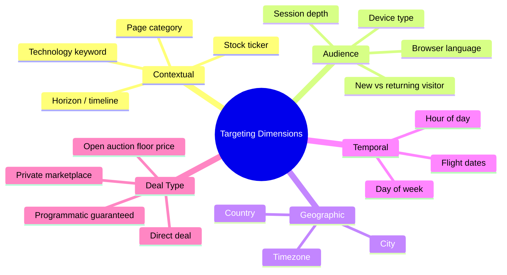
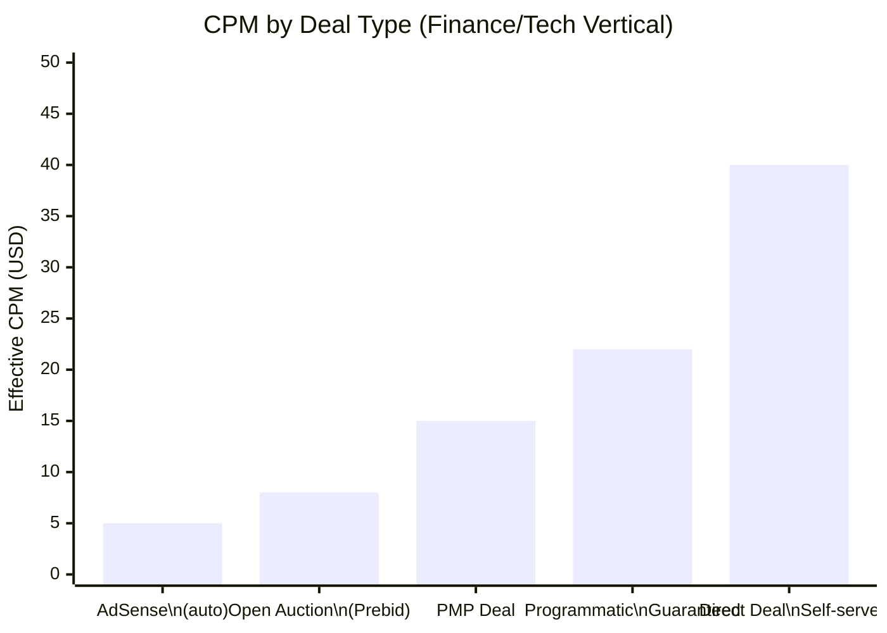
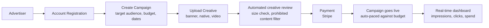
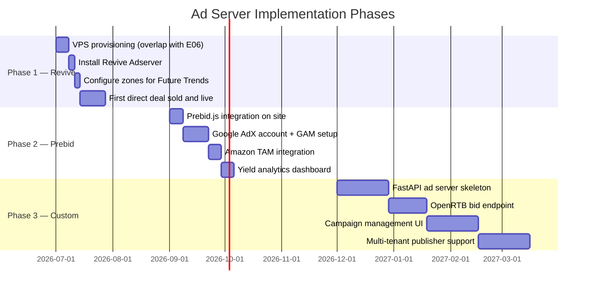

# Enhancement 08 — Monetization: First-Party Ad Server

## Problem

AdSense (Enhancement 07) is the revenue floor — passive, automated, low CPM. A first-party ad server is the ceiling: direct deals with advertisers at $15–$50 CPM, full control over creatives and placement, zero revenue share to Google, and the infrastructure to sell sponsorships programmatically at scale. It is also the core product of the Martech platform — a working ad server, built and operated by us, is a demo, a case study, and a sellable product simultaneously.

**Why build vs buy?**
- SaaS ad servers (Google Ad Manager, Xandr) take 15–30% of revenue and require minimum commitments.
- Open-source ad servers (Revive Adserver, OpenX Community) run on your VPS for $0 in licensing.
- Building a custom ad server from scratch (OpenRTB + VAST) is 3–6 months of serious engineering but produces a proprietary asset.

---

## Full-Scale Vision

A full-stack ad serving infrastructure that serves display, native, and video ads across all platform properties, supports programmatic (header bidding) and direct deals, and is architected to be licensed or operated as a managed service for third-party publishers.

```mermaid
graph TD
    subgraph Demand["Demand Sources"]
        DIRECT[Direct Advertisers\nSelf-serve portal]
        GOOGLE[Google ADX\nvia header bidding]
        APPNEXUS[Xandr / AppNexus\nvia Prebid.js]
        AMAZON[Amazon TAM\nheader bidding]
    end

    subgraph AdServer["Ad Server Core"]
        AUCT[Auction Engine\nOpenRTB 2.6]
        PACING[Pacing + Frequency Cap]
        TARGET[Targeting Engine\ngeo, device, keyword, audience]
        TRACK[Impression + Click Tracker]
        REPORT[Reporting API]
    end

    subgraph Delivery["Ad Delivery"]
        PREBID[Prebid.js\nHeader Bidding Wrapper]
        TAG[Ad Tags\nGPT / custom]
        VAST[VAST Video Tags]
    end

    subgraph Publisher["Publisher Properties"]
        FT[Future Trends]
        MT[Martech Directory]
        THIRD[Third-party Publishers\n(SaaS tier)]
    end

    DIRECT --> AUCT
    GOOGLE --> PREBID --> AUCT
    APPNEXUS --> PREBID
    AMAZON --> PREBID
    AUCT --> PACING --> TARGET --> TRACK
    TRACK --> REPORT
    REPORT --> DIRECT
    TAG --> FT
    TAG --> MT
    TAG --> THIRD
```

---

## Build Options — Phased Approach

### Phase 1: Revive Adserver (Open Source, Quick Start)

Revive Adserver is mature (formerly OpenX Community), GPL-licensed, self-hosted, and handles 99% of direct deal use cases out of the box.

```mermaid
flowchart LR
    subgraph ReviveStack["Revive Adserver Stack"]
        PHP[PHP 8.x + Apache/Nginx]
        MYSQL[MySQL / MariaDB]
        REVIVE[Revive Adserver v5.x]
        UI[Web UI — campaign management]
        TAGS[JavaScript + iframe ad tags]
    end

    subgraph Features["Capabilities"]
        BANNERS[Banner / Display ads]
        NATIVE[Native ad templates]
        ZONES[Zone management per site]
        CAPS[Frequency capping]
        SCHEDULE[Flight scheduling]
        REPORTS[Click + impression reports]
        DIRECT[Direct deal management]
    end

    ReviveStack --> Features
```



**Setup time:** 2–4 hours on a VPS. Runs alongside the Jekyll sites on the same Nginx instance.

### Phase 2: Header Bidding via Prebid.js

Prebid.js is the industry standard client-side header bidding library. It runs in the browser, calls multiple SSPs simultaneously, runs an auction, and passes the winning bid to the ad server. This maximises fill rate and yield.



### Phase 3: Custom Ad Server (Full Platform Product)

A custom-built ad server using Python (FastAPI) + SQLite/Postgres is the long-term platform asset. It is OpenRTB-compliant, multi-tenant, and designed to be sold as a managed service.



---

## Ad Formats Supported

| Format | Size | Use Case | Phase |
|--------|------|----------|-------|
| Leaderboard | 728x90 | Desktop header | 1 |
| Rectangle | 300x250 | Sidebar / in-content | 1 |
| Mobile banner | 320x50 | Mobile bottom | 1 |
| Native | Variable | In-feed, contextual | 2 |
| Half-page | 300x600 | High-impact sidebar | 2 |
| VAST Video pre-roll | 15s / 30s | Future video content | 3 |
| Sponsored content | Full page | Brand partnerships | 3 |

---

## Targeting Capabilities



---

## Revenue Model Comparison



**Implication:** A direct deal at $40 CPM delivering 100K impressions/month = $4,000/month from a single advertiser. Target: 2–3 direct deal advertisers in finance, B2B SaaS, and semiconductor tooling categories.

---

## Self-Serve Advertiser Portal

At platform scale, advertisers should be able to buy directly without human involvement. The portal sits in front of the ad server and provides:



---

## Compliance Requirements

| Requirement | Standard | Implementation |
|-------------|----------|----------------|
| GDPR consent | TCF 2.2 | Consent Management Platform (CMP) — e.g. Didomi free tier |
| CCPA opt-out | IAB CCPA | USPrivacy string via CMP |
| Ads.txt | IAB | `/ads.txt` on root domain declaring SSP relationships |
| Sellers.json | IAB | `/sellers.json` for supply chain transparency |
| Creative policy | Platform rules | Prohibited categories: adult, crypto scams, pharma without approval |

---

## Phased Implementation



---

## Success Metrics

| Metric | Phase 1 Target | Phase 2 Target | Phase 3 Target |
|--------|----------------|----------------|----------------|
| Direct campaigns running | 1 | 5 | 20+ |
| Monthly ad revenue | $200 | $1,000 | $5,000+ |
| Effective CPM | $10 | $15 | $25+ |
| Fill rate | 20% | 60% | 85%+ |
| Publishers on platform | 1 | 2 | 10+ |
| Advertisers self-served | 0 | 0 | Yes |

---

## Open Questions

- Revive Adserver is PHP/MySQL — does that align with the Python-centric platform stack, or should Phase 1 skip straight to a lightweight Python prototype?
- Header bidding (Prebid) requires Google Ad Manager (GAM) as the primary ad server for Google ADX access — is GAM the right anchor, or build around Revive with Prebid as a wrapper?
- At what point does the custom ad server become a standalone SaaS product separate from the content properties? Plan for it from Phase 3 data model design.
- Creative review automation: use Google Vision API to check uploaded banner creatives for prohibited content before they go live.
