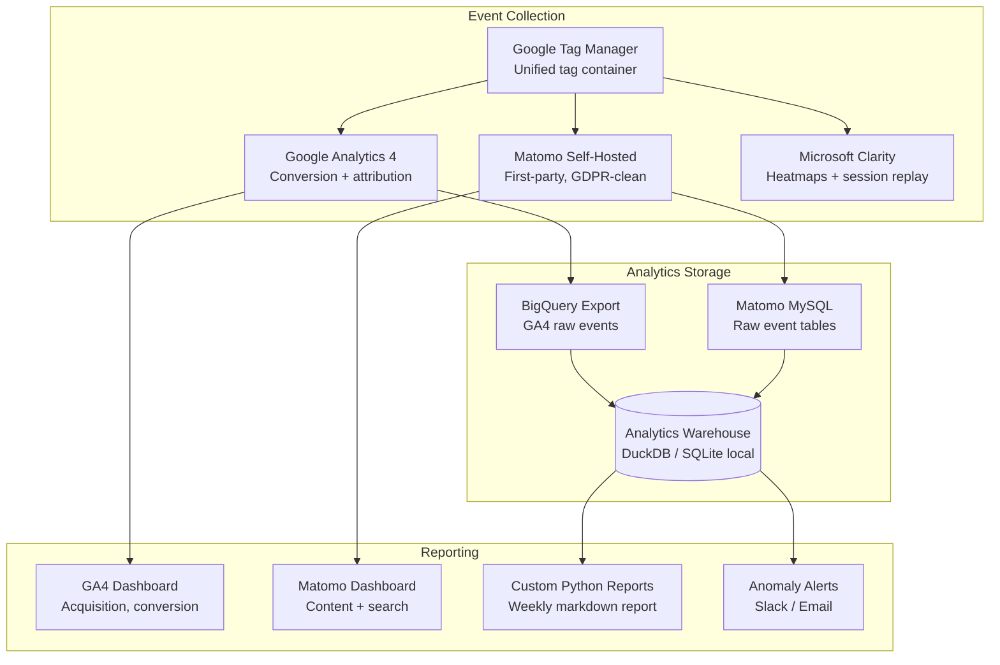
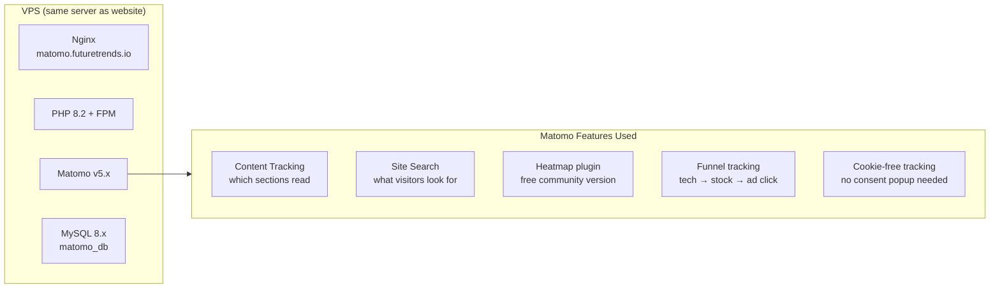
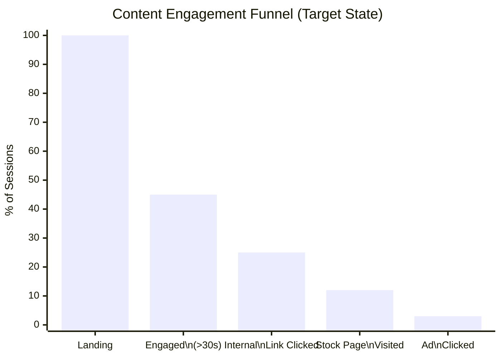

# Enhancement 09: Analytics Tracking (GA4 + Open Source)

## Problem

No analytics currently runs on the site. We cannot answer: who visits, which pages generate the most engagement, where users drop off, which tech categories attract investment-intent visitors, or whether SEO/GEO changes are working. Without measurement, every other enhancement is flying blind.

**Constraint:** Avoid paid analytics SaaS. Use Google Analytics 4 (free, ubiquitous) as the primary layer, augmented with a self-hosted Matomo instance for privacy-first, cookie-free tracking that does not depend on Google's data model.

---

## Full-Scale Vision

A dual-layer analytics stack: GA4 for conversion and attribution modelling, Matomo for raw first-party data ownership. At platform scale, all properties feed into a unified analytics warehouse: enabling cross-site audience analysis, funnel modelling across the content → ad network → monetisation pipeline, and AI-powered anomaly detection.



---

## GA4 vs Matomo: Role Separation

| Capability | GA4 | Matomo |
|------------|-----|--------|
| Acquisition channels | Primary | Secondary |
| Conversion tracking | Primary | Mirror |
| Content engagement | Secondary | Primary |
| Internal search | No | Yes |
| Cookie consent required | Yes (EU) | No (cookie-free mode) |
| Data ownership | Google owns | Self-owned |
| Sampling at scale | Yes (free tier) | No |
| GDPR compliance | Requires CMP | Built-in |
| Cost | Free | Free (self-hosted) |

---

## GA4 Implementation

### Measurement Plan

Define events before tagging: every event must map to a business question:

| Event Name | Trigger | Business Question |
|------------|---------|-------------------|
| `page_view` | All pages | Which content is most visited? |
| `tech_page_engaged` | >30s on `_tech/*` | Which technologies attract deep interest? |
| `stock_link_clicked` | Click on `/stocks/*` | Which tickers drive investment intent? |
| `sector_accordion_opened` | Accordion toggle | Which sectors attract most research? |
| `outbound_click` | Click to external site | Are users clicking through to sources? |
| `search_used` | Search interaction | What are visitors searching for? |
| `ad_impression` | Ad unit in viewport | Ad viewability per placement |
| `ad_clicked` | Ad unit click | Ad click-through by placement |

### Custom Dimensions (GA4 User Properties)

```javascript
// GA4 custom dimensions: set via GTM
gtag('set', 'user_properties', {
  'content_category': '{{ page.category }}',  // from Jekyll front matter
  'page_type': '{{ layout.name }}',            // tech_node, stock, sector
  'confidence_label': '{{ page.confidence_label }}'
});
```

This enables segmenting GA4 reports by technology category, content type, and confidence tier: unique to the platform.

---

## Matomo Self-Hosted Setup



**Cookie-free tracking config**: avoids GDPR consent popups entirely:
```php
// config/config.ini.php
[Tracker]
use_anon_id_if_profile_not_found = 0
enable_fingerprinting_across_websites = 0

// In tracking code:
_paq.push(['disableCookies']);
```

---

## Key Metrics and Dashboards



### Weekly Automated Report

A Python script pulls GA4 + Matomo APIs, generates a Markdown summary, and writes it to `_data/analytics_weekly.json`:

```python
# analytics_report.py: weekly cron
from datetime import date, timedelta
import json
from google.analytics.data_v1beta import BetaAnalyticsDataClient

# Pull top 10 pages by sessions this week
# Pull top 10 search terms from Matomo
# Compare vs prior week
# Flag pages with >20% traffic drop (SEO regression signal)
# Write to _data/analytics_weekly.json
```

---

## Phased Implementation

| Phase | Deliverable | Effort |
|-------|-------------|--------|
| 1 | GA4 property + GTM container setup | 1 day |
| 2 | Core event tracking (page_view, stock clicks, accordion opens) | 2 days |
| 3 | GA4 custom dimensions (category, page_type) | 1 day |
| 4 | Matomo self-hosted on VPS (post domain migration) | 2 days |
| 5 | Cookie-free Matomo tracking mode | 1 day |
| 6 | Microsoft Clarity heatmaps | 1 day |
| 7 | Weekly Python analytics report | 1 week |
| 8 | GA4 → BigQuery export + local DuckDB warehouse | 1 week |

---

## Success Metrics

| Metric | Baseline | 30-Day Target |
|--------|----------|---------------|
| Analytics data available | None | GA4 + Matomo live |
| Events tracked | 0 | 8+ custom events |
| Session duration (avg) | Unknown | >90s |
| Pages per session | Unknown | >2.5 |
| Bounce rate | Unknown | <60% |
| Top-10 content pages identified | No | Yes (weekly) |

---

## Open Questions

- GA4 BigQuery export is free up to 10GB/month: sufficient for current traffic. At scale, does the pipeline move to a proper warehouse (ClickHouse, Snowflake) or stay on local DuckDB?
- Matomo requires PHP: does that conflict with the Python-centric VPS setup? No: PHP-FPM runs alongside Python FastAPI via Nginx as separate services.
- Should Matomo and Clarity both run, given overlap in heatmap/session replay functionality? Yes: Clarity is free and cloud-hosted, zero maintenance. Matomo heatmaps require the paid plugin. Use both until one proves redundant.
