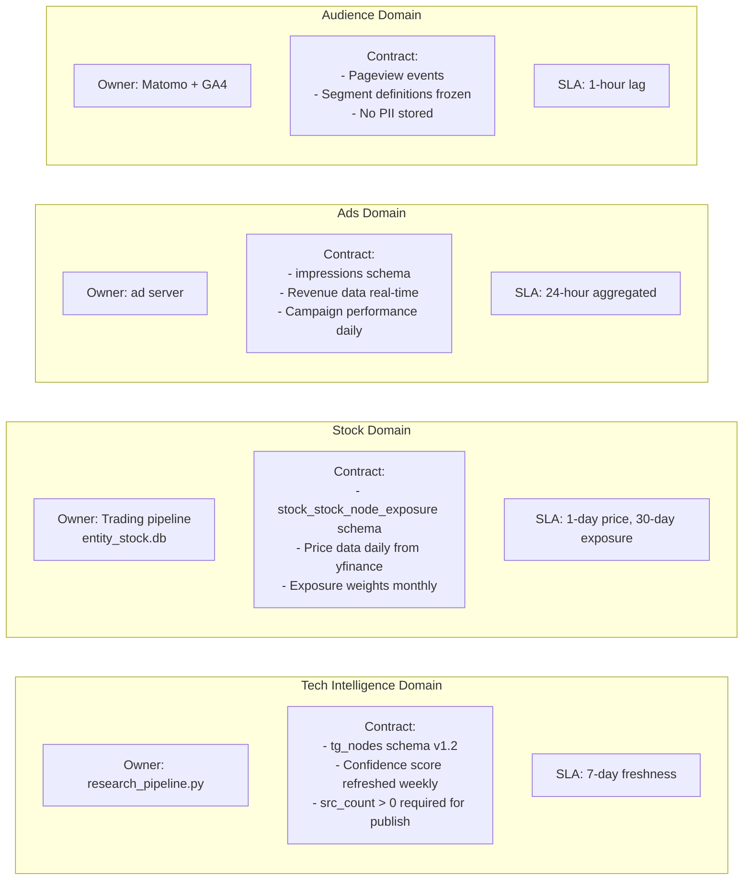
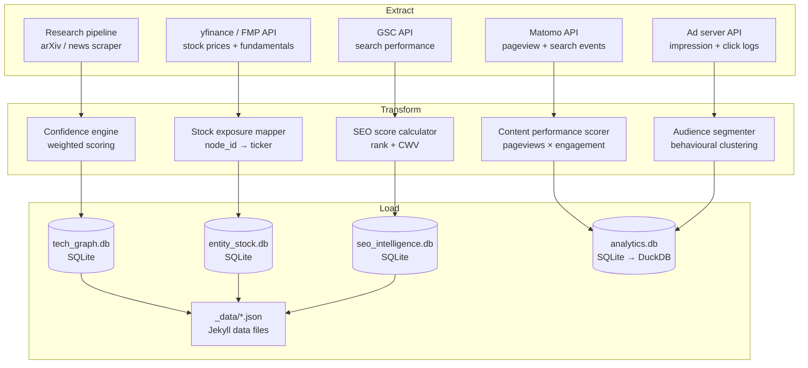
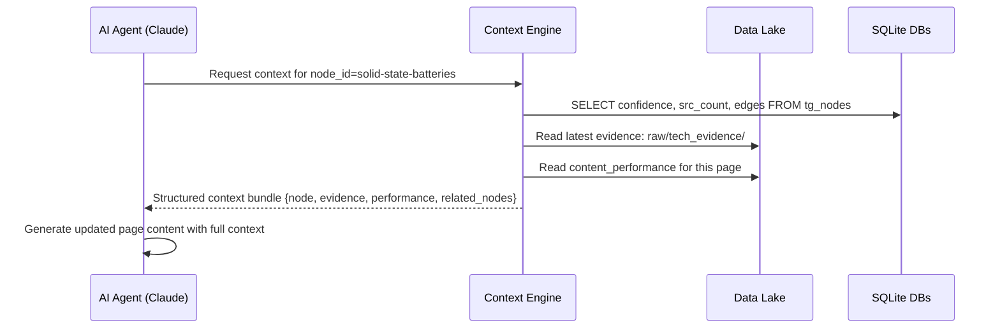
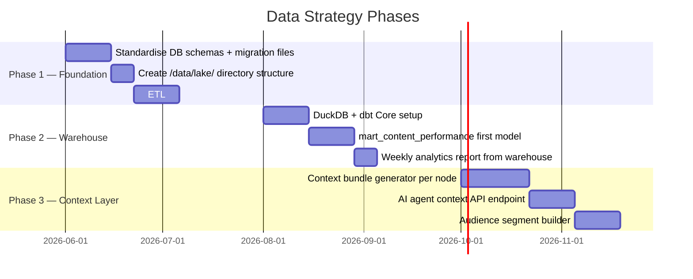

# Enhancement 10 — Data Strategy (Data Lake, Mesh, ETL)

## Problem

The platform currently generates and consumes data in fragmented silos: `tech_graph.db` holds technology intelligence, `entity_stock.db` holds stock mappings, `seo_intelligence.db` (planned) holds SEO signals, `matomo_db` will hold analytics, and GA4 exports raw events to BigQuery. No unified data model connects them. No ETL pipeline moves data between layers. No governance policy defines ownership or freshness SLAs.

This matters because — as the Martech for 2026 report states — **56.3% of companies cite poor data quality as their #1 AI implementation challenge**, and **"AI is a commodity; context is differentiation."** The quality of the platform's AI outputs (confidence scores, personalisation, ad targeting) is a direct function of data architecture quality.

---

## Full-Scale Vision

A platform data strategy built on three layers: a **data lake** for raw ingested data, a **data warehouse** for curated analytical models, and a **data mesh** pattern for distributing data ownership across domains (Tech Intelligence, Stock, Analytics, Ads). ETL pipelines maintain freshness. A unified context layer feeds AI agents with clean, governed data.

```mermaid
graph TD
    subgraph Sources["Data Sources"]
        ARXIV[arXiv / Research Papers]
        NEWS[News APIs\nReuters, FT feeds]
        FILINGS[SEC Filings / Earnings]
        GSC[Google Search Console]
        GA4[GA4 / Matomo]
        ADS[Ad Server Events]
        SOCIAL[Social Listening\nReddit, X, LinkedIn]
    end

    subgraph Lake["Data Lake (Raw)"]
        RAW_TECH[raw/tech_evidence/]
        RAW_STOCK[raw/stock_prices/]
        RAW_SEO[raw/seo_signals/]
        RAW_ANALYTICS[raw/analytics_events/]
        RAW_ADS[raw/ad_impressions/]
    end

    subgraph Warehouse["Data Warehouse (Curated)"]
        DIM_TECH[dim_tech_nodes]
        DIM_STOCK[dim_stocks]
        FACT_CONF[fact_confidence_log]
        FACT_SEO[fact_seo_rankings]
        FACT_ADS[fact_ad_performance]
        MART_CONTENT[mart_content_performance\nJoins tech + SEO + analytics]
    end

    subgraph Mesh["Data Mesh — Domain Ownership"]
        DOMAIN_TECH[Tech Intelligence Domain\nowner: research pipeline]
        DOMAIN_STOCK[Stock Domain\nowner: trading pipeline]
        DOMAIN_ADS[Ads Domain\nowner: ad server]
        DOMAIN_AUDIENCE[Audience Domain\nowner: analytics stack]
    end

    subgraph Context["Context Layer (AI Feeds)"]
        CTX_AGENT[Context for AI Agents\ncurated JSON / Parquet]
        CTX_RECO[Recommendation Engine\ncontent similarity]
        CTX_PERSONAL[Personalisation Engine\naudience segments]
    end

    Sources --> Lake
    Lake --> Warehouse
    Warehouse --> Mesh
    Mesh --> Context
```



---

## Data Domains and Ownership

The data mesh pattern assigns each domain an **owner**, a **SLA**, and a **contract** (schema + freshness guarantee):



---

## ETL Architecture



### ETL Tool Choice

| Need | Tool | Why |
|------|------|-----|
| Simple Python transforms | `pandas` + custom scripts | Already in stack |
| Scheduled orchestration | `cron` → Python | No extra infra |
| Complex multi-source DAGs | Apache Airflow (self-hosted) | When pipelines > 10 |
| Lightweight DAG alternative | Prefect OSS or `dagster` OSS | Easier than Airflow |
| Stream processing (future) | Apache Kafka → Flink | When ad events need real-time |
| Local data exploration | DuckDB + dbt Core | SQL on Parquet files |

**Recommendation (current phase):** cron + Python scripts. Migrate to Prefect OSS when pipeline count exceeds 8.

---

## Data Lake File Structure

```
/data/lake/
├── raw/
│   ├── tech_evidence/
│   │   ├── 2025-05-24_arxiv_ingest.jsonl
│   │   ├── 2025-05-25_reuters_ingest.jsonl
│   ├── stock_prices/
│   │   ├── 2025-05-24_prices.parquet
│   ├── seo_signals/
│   │   ├── 2025-05-24_gsc_export.json
│   ├── analytics_events/
│   │   ├── 2025-05-24_matomo_events.parquet
├── curated/
│   ├── tech_confidence_timeseries.parquet
│   ├── content_performance_weekly.parquet
│   ├── ad_revenue_daily.parquet
├── context/
│   ├── ai_context_tech.json      # Feed for AI agents
│   ├── ai_context_stocks.json
│   ├── audience_segments.json
```

---

## Context Engineering for AI Agents

The PDF identifies **context engineering** — getting the right data to the right AI agent at the right time — as the defining challenge of agentic martech. Our platform's AI agents (content production, SEO, personalisation) need structured context bundles, not raw DB queries.



**Context bundle schema:**
```json
{
  "node_id": "solid-state-batteries",
  "name": "Solid-State Batteries",
  "confidence": 0.62,
  "src_count": 7,
  "stage": "pilot",
  "recent_evidence": ["2025-04-12 Toyota pilot scale...", "2025-03-08 CATL roadmap..."],
  "pageviews_30d": 1240,
  "top_queries": ["solid state battery timeline", "SSB stocks 2026"],
  "linked_tickers": ["TM", "CATL", "PANASONIC"],
  "enables": ["ev-next-gen-range", "grid-storage-lithium-free"],
  "requires": ["solid-electrolyte-manufacturing"]
}
```

---

## Data Governance Policy

| Rule | Detail |
|------|--------|
| No PII in any DB | Analytics uses anonymised IDs only |
| Schema versioning | Every DB schema change creates a migration file |
| Freshness SLA per domain | See domain contracts above |
| Backup cadence | Daily `sqlite3 .dump` → compressed archive |
| Retention | Raw events: 90 days. Curated: indefinite. |
| Access | All DBs read-only to web process; write via pipeline only |

---

## Phased Implementation



---

## Success Metrics

| Metric | Baseline | Target |
|--------|----------|--------|
| Data domains with defined owners | 0 | 4 |
| ETL pipelines with SLAs | 0 | 6 |
| Raw events archived to data lake | 0% | 100% |
| Cross-domain analytics model | None | mart_content_performance live |
| Context bundles available for AI agents | 0 | 212 (all tech nodes) |
| Data quality issues caught automatically | 0 | Alerts within 24h |

---

## Open Questions

- DuckDB vs SQLite for the warehouse tier: DuckDB is dramatically faster for analytical queries but requires a separate runtime. Switch when query time on SQLite exceeds 2 seconds.
- Should the data lake use local filesystem (Parquet files) or object storage (MinIO self-hosted equivalent of S3)? Local filesystem is sufficient up to ~10GB. Add MinIO at platform scale.
- Apache Airflow is overkill for this pipeline today. At what point does complexity justify Airflow? When there are 3+ inter-dependent pipelines with conditional logic and retry requirements.
