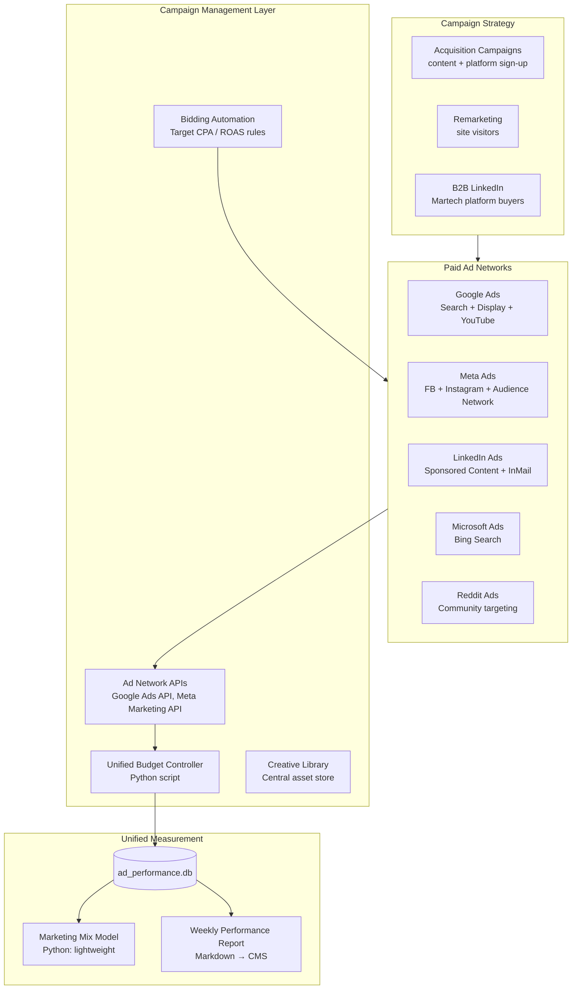
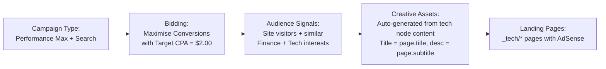
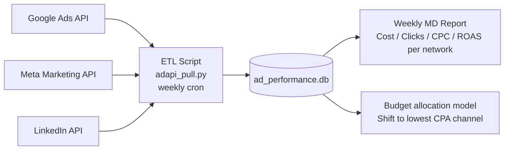
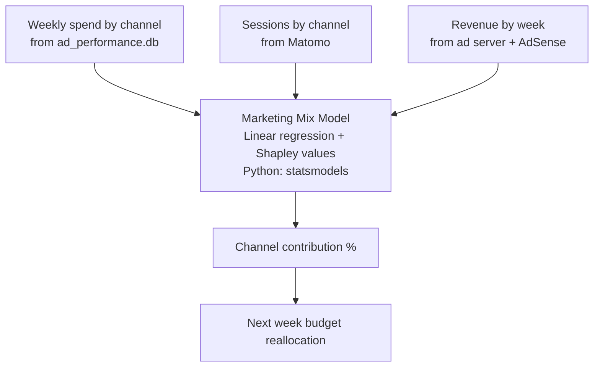

# Enhancement 11: Ad Network Management (Google, Meta, LinkedIn)

## Problem

The platform currently earns zero from paid channels and has no infrastructure to run, manage, or measure paid advertising campaigns. As content reaches scale and the Martech platform develops, two paid-channel needs emerge simultaneously: (1) **paid acquisition**: using Google Ads, Meta Ads, and LinkedIn Ads to drive targeted traffic to high-value content and platform sign-ups; and (2) **ad network operations**: managing multiple demand sources for the first-party ad server (Enhancement 08). Both require a unified campaign management framework that avoids vendor lock-in and keeps management overhead low.

---

## Full-Scale Vision

A hub-and-spoke campaign management architecture where a central data warehouse stores performance data from all ad networks, a unified bidding strategy governs budget allocation, and a Python automation layer handles routine optimisation tasks that would otherwise require expensive DSP seats.



---

## Network Role Allocation

| Network | Primary Use Case | Audience | Est. CPM |
|---------|-----------------|----------|----------|
| Google Search | Capture investment-intent queries | People searching "battery stocks 2026" | $2–$8 CPC |
| Google Display | Remarketing to site visitors | Cookie-based retargeting | $1–$5 CPM |
| Meta Ads | Awareness + content amplification | Tech-interested 25–45 age groups | $5–$15 CPM |
| LinkedIn Ads | Martech platform B2B acquisition | Marketing ops, CMOs, MarTech buyers | $20–$80 CPM |
| Reddit Ads | Community targeting, organic-feel | r/investing, r/technology, r/MachineLearning | $3–$10 CPM |
| Microsoft/Bing | Lower CPCs, finance audience | Older, higher-income search users | $1–$5 CPC |

---

## Google Ads: Automated Bidding Strategy

No manual bidding. Use Google's Smart Bidding with custom rules overlaid via the Ads API:



**Key automation:** Python script reads the top-10 performing tech node pages from Matomo weekly and automatically creates/pauses Google Ads campaigns targeting those page topics:

```python
# campaign_auto_manager.py
# 1. Pull top-10 pages by pageviews + engagement from Matomo API
# 2. For each top page: ensure Google Ads campaign exists for target keyword
# 3. For underperforming campaigns (CPC > $5, CTR < 1%): pause or reduce budget
# 4. Write campaign changes report to _data/ads_weekly.json
```

---

## Meta Ads: Content Amplification

Meta is best for amplifying content to interest-based audiences, not capturing search intent. Strategy: promote the highest-confidence tech node pages as lead content.

```mermaid
flowchart TD
    SELECT[Select top-confidence pages\nconf >= 0.65, src >= 5] --> COPY[Generate ad copy\nfrom page.subtitle + horizon]
    COPY --> AUDIENCE_META[Target audiences:\n- Interest: Investing, Technology, AI\n- Lookalike: site visitors\n- Remarketing: non-converted visitors]
    AUDIENCE_META --> FORMAT[Ad formats:\n- Single image: stock chart style\n- Carousel: 3 related tech nodes\n- Video: timeline animation (future)]
    FORMAT --> MEASURE[Measure: link clicks + CPM\nFrequency cap: 3 per 7 days]
```

**Meta CAPI (Conversion API):** Send server-side conversion events to avoid iOS attribution loss. Implemented via a lightweight FastAPI endpoint on the VPS that relays Matomo goal completions to Meta's Conversions API.

---

## LinkedIn Ads: B2B Platform Acquisition

LinkedIn is expensive ($20–$80 CPM) but the only channel with job-title and company-size targeting. Use only for the Martech platform (Enhancement 05), not for content traffic acquisition.

| Campaign Goal | Targeting | Format | Budget |
|---------------|-----------|--------|--------|
| Martech platform awareness | CMO, VP Marketing, Marketing Ops | Sponsored Content (article link) | $20/day |
| Platform sign-up lead gen | Marketing Director at 100-1000 employee companies | Lead Gen Form | $30/day |
| Retargeting engaged visitors | Matched from LinkedIn Insight Tag | Message Ad | $15/day |

LinkedIn Insight Tag installation (1 line via GTM):
```javascript
// GTM Custom HTML tag: LinkedIn Insight Tag
_linkedin_partner_id = "XXXXXXX";
// ... standard tag
```

---

## Unified Performance Dashboard

All ad networks report to a single Python-built performance dashboard. No paying for a third-party attribution tool:



```python
# adapi_pull.py: unified pull
# Google Ads: google-ads Python library (free)
# Meta: facebook-business Python SDK (free)
# LinkedIn: linkedin-api (unofficial, free) or Marketing API (official, free tier)
# Output: ad_performance.db: campaigns, spend, clicks, conversions per day
```

---

## Attribution Model

No paid attribution tool. Use a lightweight Python marketing mix model (MMM) on the ad_performance + analytics data:



---

## Phased Implementation

| Phase | Deliverable | Effort |
|-------|-------------|--------|
| 1 | Google Ads account + first Search campaign | 2 days |
| 2 | Meta Ads account + top-10 content amplification | 2 days |
| 3 | LinkedIn Insight Tag via GTM | 1 day |
| 4 | API credential vault + `adapi_pull.py` skeleton | 1 week |
| 5 | Unified ad performance DB + weekly report | 1 week |
| 6 | Campaign auto-manager (pause underperformers) | 1 week |
| 7 | Meta CAPI server-side events | 1 week |
| 8 | MMM attribution model | 2 weeks |

---

## Success Metrics

| Metric | Baseline | 3-Month Target |
|--------|----------|----------------|
| Ad networks active | 0 | 3 (Google, Meta, LinkedIn) |
| Monthly ad-driven sessions | 0 | 2,000+ |
| Cost per session | N/A | <$0.50 (Google Display/Meta) |
| LinkedIn cost per lead | N/A | <$30 |
| Attribution model live | No | Yes |
| Campaign management time/week | N/A | <2 hours |

---

## Open Questions

- Reddit Ads API is limited: campaign management mostly via UI. Include only when content is generating strong organic Reddit engagement (use Social Listening, Enhancement 14, to detect this).
- LinkedIn API has strict rate limits and requires OAuth: start with manual campaign management and add API automation in Phase 2.
- Google Ads Performance Max campaigns use AI to auto-place across Search, Display, YouTube, Gmail. This reduces manual control but improves reach. Use Performance Max for content amplification, manual Search campaigns for intent capture.
