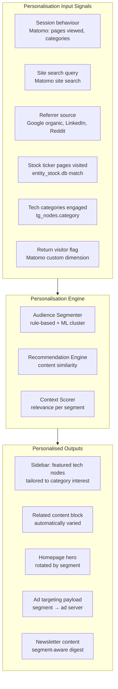
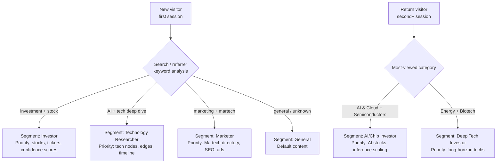
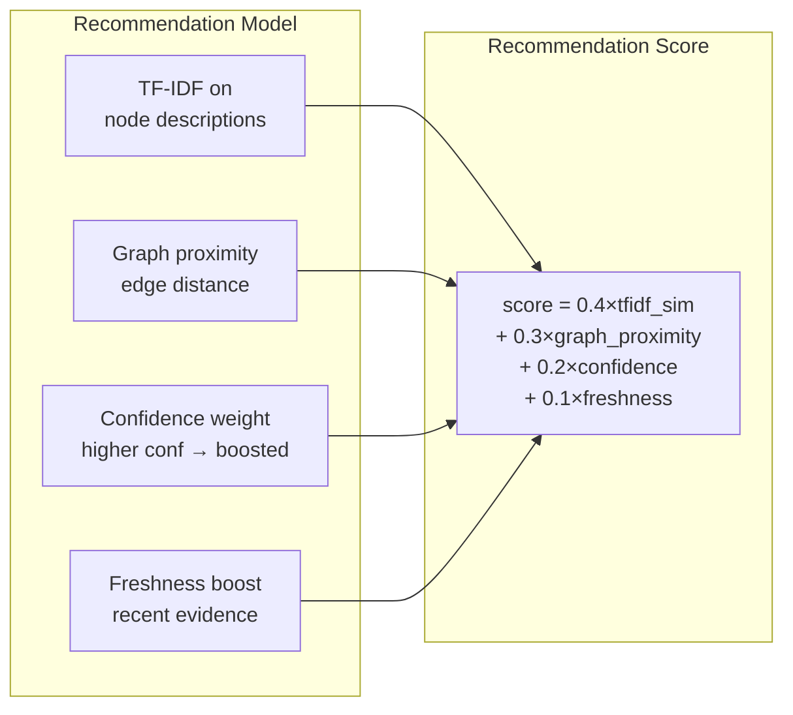

# Enhancement 12: Personalisation

## Problem

Every visitor to the platform sees identical content regardless of their interests, behaviour history, or intent signals. A visitor researching battery technology and a visitor tracking AI chips receive the same homepage, the same sidebar, the same recommended pages. This wastes engagement potential and reduces content-to-conversion efficiency. The Martech for 2026 report identifies personalisation as the defining competitive advantage of AI-powered marketing: **"Customers now expect every interaction to be contextually relevant and responsive to their immediate needs."**

**Constraint:** No paid personalisation SaaS (no Optimizely, no Salesforce Interaction Studio). Build on first-party data from Matomo + the tech graph DB.

---

## Full-Scale Vision

A multi-layer personalisation system that adapts page content, recommendations, and ad targeting to individual visitor context: inferred from behaviour, session data, and content engagement history. At platform scale, personalisation feeds are available to all properties via a shared API, enabling consistent cross-site audience experiences.



---

## Audience Segments

Define 6 core segments based on behavioural signals from Matomo. Segments are mutually exclusive with a priority order:



| Segment | Primary Interest | Recommended Content | Ad Targeting |
|---------|-----------------|--------------------|--------------| 
| Investor | Stock returns, timelines | `/stocks/*`, confidence-high nodes | Finance ads |
| Tech Researcher | Deep technical understanding | Tech node → prerequisites chain | Developer tools ads |
| Marketer | Martech stack, platform | Martech directory, sector/marketing | SaaS ads |
| AI/Chip Investor | NVDA, TSM, AI infrastructure | `/sectors/ai/`, `/sectors/semiconductors/` | Trading platform ads |
| Deep Tech Investor | Biotech, energy, long-horizon | 2030+ timeline nodes | Impact investing ads |
| General | Unknown intent | Curated "What to read first" | General tech ads |

---

## Personalisation Without Cookies

Matomo's cookie-free mode means personalisation must be session-scoped or use localStorage/IndexedDB for first-party persistence:

```javascript
// personalisation.js: vanilla JS, no framework needed

const PersonalisationEngine = {
  // Read session behaviour from sessionStorage
  getSessionProfile() {
    const viewed = JSON.parse(sessionStorage.getItem('viewed_categories') || '[]');
    const searches = JSON.parse(sessionStorage.getItem('searches') || '[]');
    return { viewed, searches };
  },

  // Infer segment from session
  inferSegment(profile) {
    const catCounts = profile.viewed.reduce((acc, cat) => {
      acc[cat] = (acc[cat] || 0) + 1; return acc;
    }, {});
    const topCat = Object.entries(catCounts).sort((a,b) => b[1]-a[1])[0];
    if (!topCat) return 'general';
    if (['AI & Cloud', 'Semiconductors'].includes(topCat[0])) return 'ai_chip_investor';
    if (['Biotech', 'Energy Tech'].includes(topCat[0])) return 'deep_tech_investor';
    return 'tech_researcher';
  },

  // Update recommendation block on page
  updateRecommendations(segment) {
    const reco = document.getElementById('personalised-recommendations');
    if (!reco) return;
    fetch(`/api/recommendations?segment=${segment}&current=${window.location.pathname}`)
      .then(r => r.json())
      .then(data => {
        reco.innerHTML = data.nodes.map(n =>
          `<li><a href="${n.url}">${n.name}</a>: ${n.horizon}</li>`
        ).join('');
      });
  }
};
```

---

## Recommendation Engine

Content similarity using TF-IDF on node descriptions + edge graph proximity:



Pre-computed nightly from `tech_graph.db` and written to `_data/recommendations.json`. No server-side computation on page load: the recommendation API reads the pre-built index.

---

## Homepage Personalisation

The homepage hero rotates between segment-specific callouts. Jekyll `` blocks check a JS-injected class on `<body>`:

```html
<!-- _layouts/home.html: segment-aware hero -->
<section class="hero" id="hero">
  <!-- Default: shown to all, overridden by JS for known segments -->
  <h1>Future Technology Intelligence</h1>
  <p>212 technologies tracked. Evidence-weighted. Updated weekly.</p>
</section>

<!-- Segment variants (hidden by default, shown by JS) -->
<template id="hero-investor">
  <h1>Track Technologies Before They Move Markets</h1>
  <p>Confidence scores, deployment timelines, and stock exposure for 212 frontier technologies.</p>
</template>
<template id="hero-ai_chip_investor">
  <h1>AI Infrastructure: What's Real, What's Hype</h1>
  <p>Evidence-based tracking of inference scaling, silicon roadmaps, and data centre build-out.</p>
</template>
```

---

## Phased Implementation

| Phase | Deliverable | Effort |
|-------|-------------|--------|
| 1 | Matomo custom dimensions for category tracking | 2 days |
| 2 | Session profile JS (track viewed categories) | 2 days |
| 3 | Segment inference logic in `personalisation.js` | 3 days |
| 4 | Recommendation engine (TF-IDF + graph proximity) | 1 week |
| 5 | Pre-computed `_data/recommendations.json` nightly | 2 days |
| 6 | Homepage segment-aware hero variants | 2 days |
| 7 | Sidebar personalised tech node block | 2 days |
| 8 | Segment → ad server targeting payload | 1 week |

---

## Success Metrics

| Metric | Baseline | 3-Month Target |
|--------|----------|----------------|
| Personalised recommendations live | No | Yes |
| Recommendation click-through rate | N/A | >8% |
| Pages per session (segmented vs general) | N/A | +30% for segmented visitors |
| Segment inference accuracy | N/A | >70% (validated via A/B) |
| Ad targeting CPM lift (segmented vs non) | N/A | +40% |

---

## Open Questions

- Is session-storage personalisation sufficient, or should the platform build user accounts for persistent preferences? Start with session-based; add accounts when the Martech platform SaaS tier launches.
- GDPR: is behavioural segment inference from anonymous session data compliant without consent? Yes: no PII is stored or processed. Cookie-free Matomo collects only aggregate signals. Legal: document in privacy policy.
- Synthetic customer simulation (from the Martech for 2026 PDF): should the platform use a simulated audience model (e.g., Brox, Panoplai equivalent built in Python) to test personalisation hypotheses before deploying to real users? Yes: add as a sub-feature of Enhancement 13 (experimentation).
