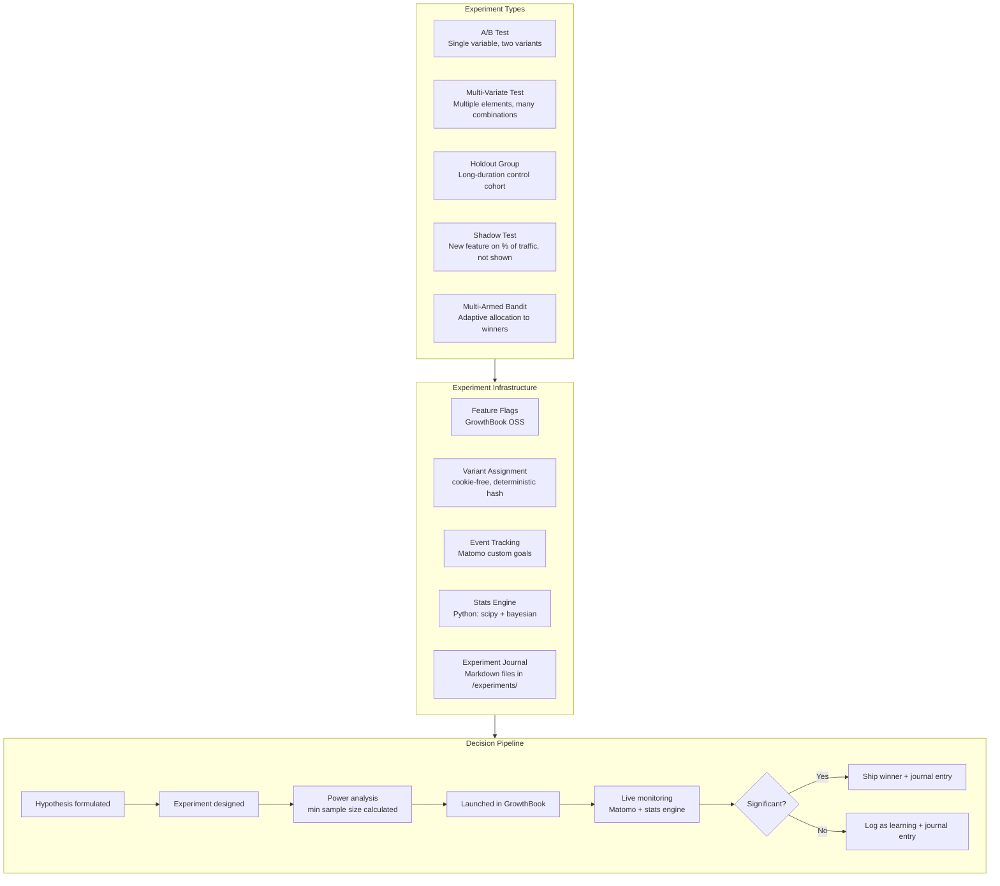
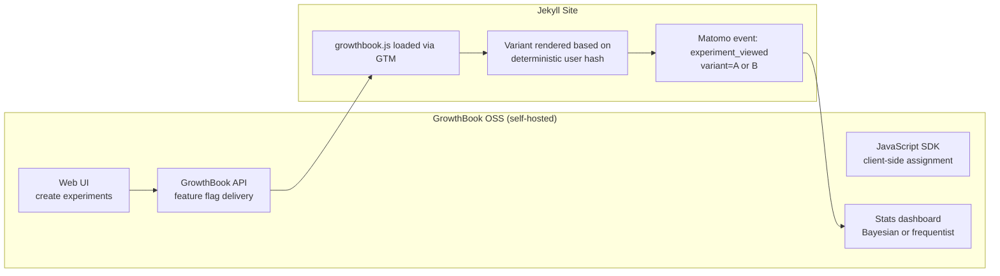
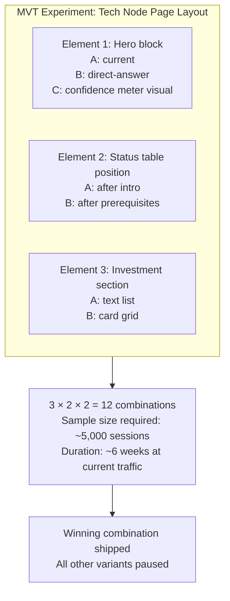
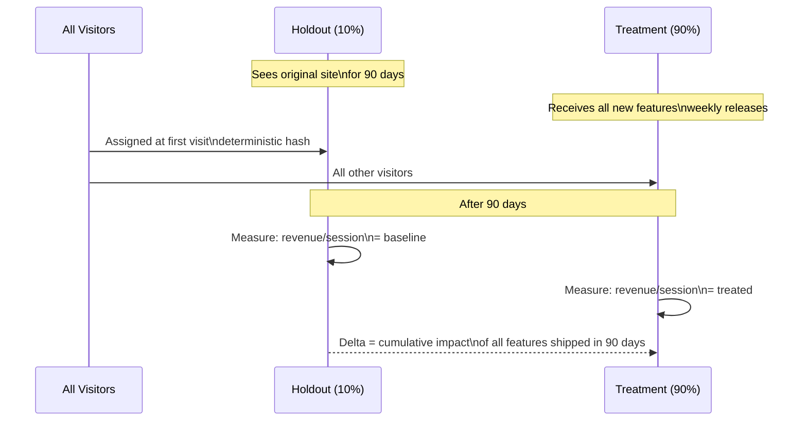
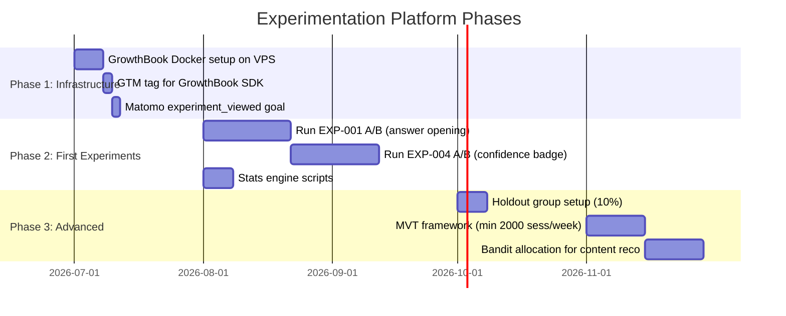

# Enhancement 13: Experimentation: A/B, MVT, Holdouts & Advanced Testing

## Problem

No experiments run on the platform today. Every design, copy, or layout change is deployed without a control condition: there is no way to know whether a change improved or harmed conversion, engagement, or revenue. At scale, untested changes compound into unattributable noise. The Martech for 2026 report notes that the leading marketing organisations are building **experiment journals**: structured logs of hypotheses, tests, and learnings: as a competitive knowledge asset.

**Constraint:** No paid experimentation tools (no Optimizely, no VWO, no LaunchDarkly). Build on open-source and free tooling.

---

## Full-Scale Vision

A full experimentation platform covering statistical A/B tests, multi-variate tests (MVT), holdout groups for long-running experiments, and an experiment journal that accumulates institutional knowledge across all properties. At platform scale, the same infrastructure tests changes across Future Trends, the Martech Directory, and any new verticals.



---

## GrowthBook: Free Open-Source Feature Flags + A/B

GrowthBook is the leading open-source experimentation platform. It provides feature flags, A/B test assignment, and a stats engine. Self-hosted, zero licensing cost.



**Setup:** GrowthBook runs as a Docker container on the same VPS as the website.

```yaml
# docker-compose.yml: GrowthBook
services:
  growthbook:
    image: growthbook/growthbook:latest
    ports: ["3100:3100"]
    environment:
      MONGODB_URI: mongodb://mongo:27017/growthbook
      APP_ORIGIN: https://experiments.futuretrends.io
  mongo:
    image: mongo:6
```

---

## A/B Test Examples (Current Priority)

| Test ID | Hypothesis | Control | Variant | Primary Metric |
|---------|-----------|---------|---------|----------------|
| EXP-001 | Direct-answer opening paragraph increases engagement | Current page intro | AIO-style direct answer first | Time on page |
| EXP-002 | FAQ section increases AI Overview citations | No FAQ | FAQ with schema markup | AIO impressions (GSC) |
| EXP-003 | Sidebar personalisation increases pages/session | Static sidebar | Personalised recommendations | Pages per session |
| EXP-004 | Confidence badge colour affects click-through | Current badge | High-contrast badge | Outbound click rate |
| EXP-005 | In-content ad placement (after intro vs mid-page) | Ad after intro | Ad mid-page | Ad revenue per session |

---

## Multi-Variate Testing (MVT)

MVT tests multiple independent elements simultaneously. Useful for page layout changes where element interactions are expected:



**Warning:** MVT requires significantly more traffic than A/B. Do not run MVT until the site reaches 2,000+ sessions/week.

---

## Holdout Groups

A holdout group is a segment of users permanently excluded from a feature. Used for measuring the long-term cumulative effect of multiple changes:



**Implementation:** GrowthBook supports holdout groups natively via feature flag conditions. Set `holdout` attribute to `true` for 10% of users using `userId.hash % 10 === 0`.

---

## Statistical Engine

All experiment analysis runs in Python, not in a paid tool:

```python
# stats_engine.py
import numpy as np
from scipy import stats
from scipy.stats import beta as beta_dist

def frequentist_ab(control_conversions, control_visitors,
                   variant_conversions, variant_visitors,
                   alpha=0.05):
    """Two-proportion z-test. Returns p-value and relative lift."""
    p_c = control_conversions / control_visitors
    p_v = variant_conversions / variant_visitors
    # pooled proportion
    p_pool = (control_conversions + variant_conversions) / (control_visitors + variant_visitors)
    se = np.sqrt(p_pool * (1 - p_pool) * (1/control_visitors + 1/variant_visitors))
    z = (p_v - p_c) / se
    p_value = 2 * (1 - stats.norm.cdf(abs(z)))
    lift = (p_v - p_c) / p_c
    return {"p_value": p_value, "significant": p_value < alpha, "lift": lift}

def bayesian_ab(control_conversions, control_visitors,
                variant_conversions, variant_visitors,
                simulations=100000):
    """Bayesian A/B using Beta-Binomial. Returns P(variant > control)."""
    control_samples = beta_dist.rvs(control_conversions + 1,
                                     control_visitors - control_conversions + 1,
                                     size=simulations)
    variant_samples = beta_dist.rvs(variant_conversions + 1,
                                     variant_visitors - variant_conversions + 1,
                                     size=simulations)
    return {"prob_variant_wins": np.mean(variant_samples > control_samples)}
```

---

## Experiment Journal

Every experiment: whether it wins or loses: produces a journal entry. These accumulate institutional knowledge:

```markdown
# EXP-001: Direct Answer Opening Paragraph

**Hypothesis:** A direct-answer first paragraph increases average session time
by making content immediately useful to research-intent visitors.

**Status:** Completed: WINNER ✓
**Period:** 2026-07-01 to 2026-07-21 (3 weeks)
**Traffic allocation:** 50/50 split

## Results
| Metric | Control | Variant | Lift | P-value |
|--------|---------|---------|------|---------|
| Avg. time on page | 68s | 89s | +31% | 0.003 |
| Pages per session | 2.1 | 2.4 | +14% | 0.02 |
| Bounce rate | 61% | 54% | -11% | 0.04 |

## Decision
Ship variant to 100%. Update all 212 tech node pages via regen_tech_pages.py.

## Learning
Research-intent visitors engage more deeply when the answer appears immediately.
Matches AIO optimisation direction: same change serves both goals.

## Follow-up
Run EXP-002 (FAQ section) on top of this variant.
```

---

## Phased Implementation



---

## Success Metrics

| Metric | Baseline | 6-Month Target |
|--------|----------|----------------|
| Experiments completed | 0 | 6+ |
| Journal entries | 0 | 6+ (win and loss) |
| Statistical significance threshold | N/A | p < 0.05 (frequentist) or P(win) > 95% (Bayesian) |
| Sample size calculator used | No | Yes: all experiments pre-powered |
| Holdout group established | No | Yes (10% of traffic) |
| Cumulative feature lift measured | No | Yes (90-day holdout readout) |

---

## Open Questions

- GrowthBook requires MongoDB: does that add unacceptable VPS memory overhead? GrowthBook also supports a `no-db` mode with YAML config. Start with YAML mode, upgrade to MongoDB when experiment count exceeds 20.
- At what traffic level is MVT statistically feasible? Rule of thumb: 4× the sample size of the most complex variant combination. At 200 sessions/day, a 12-combination MVT requires ~60 days. Only run MVT at 500+ sessions/day.
- Should the experiment journal live in the platform repo as `.md` files or in a separate Notion/Obsidian vault? Repo-based markdown is correct: it stays under version control and is auditable.
