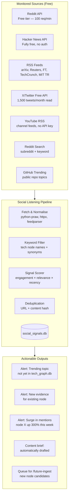
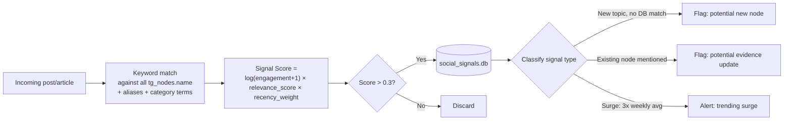
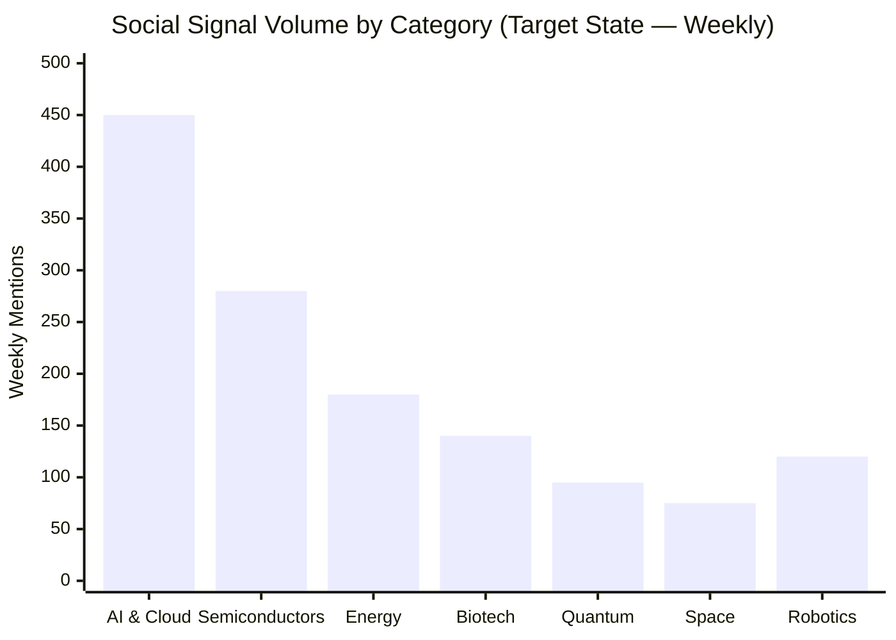

# Enhancement 14 — Social Listening (No Paid Tools)

## Problem

The platform publishes research content but operates in an information vacuum — it does not monitor what audiences are saying about the technologies it tracks, which topics are generating discussion spikes, or when a tracked technology appears in breaking news or viral threads. Social listening closes this gap: it surfaces emerging signals before they hit mainstream research, identifies content gaps where high-volume conversation exists but no platform page does, and detects when competitor sites or AI models are citing (or ignoring) our content.

**Constraint:** No paid social listening tools (no Brandwatch, no Sprinklr, no Mention.com). Build entirely on free APIs, open-source scrapers, and RSS feeds.

---

## Full-Scale Vision

A Python-based social listening engine that monitors Reddit, X/Twitter (via free API tier), LinkedIn public content, Hacker News, and RSS feeds from key industry sources. It runs on a daily cron, writes signals to `social_signals.db`, and surfaces actionable alerts — new content to create, nodes to update, and trending topics to amplify.



---

## Source Configuration

### Reddit Monitoring

Reddit's PRAW library is free and provides structured access to posts, comments, and search:

```python
# reddit_listener.py
import praw
from datetime import datetime, timezone

reddit = praw.Reddit(
    client_id="YOUR_APP_ID",      # free — create at reddit.com/prefs/apps
    client_secret="YOUR_SECRET",
    user_agent="FutureTrends Social Listener v1.0"
)

SUBREDDITS_TO_MONITOR = [
    "investing", "stocks", "SecurityAnalysis",
    "artificial", "MachineLearning", "singularity",
    "Futurology", "technology", "energy", "biotech",
    "spacex", "quantum_computing", "robotics",
    "SyntheticBiology", "Semiconductors"
]

def fetch_hot_posts(subreddit_name, limit=25):
    sub = reddit.subreddit(subreddit_name)
    for post in sub.hot(limit=limit):
        yield {
            "source": f"reddit/{subreddit_name}",
            "title": post.title,
            "url": post.url,
            "score": post.score,
            "comments": post.num_comments,
            "created": datetime.fromtimestamp(post.created_utc, tz=timezone.utc).isoformat(),
            "text": post.selftext[:500]
        }
```

### Hacker News Monitoring

HN API is completely free with no authentication:

```python
# hn_listener.py
import httpx

def fetch_hn_top(limit=30):
    ids = httpx.get("https://hacker-news.firebaseio.com/v0/topstories.json").json()[:limit]
    for story_id in ids:
        item = httpx.get(f"https://hacker-news.firebaseio.com/v0/item/{story_id}.json").json()
        if item.get("type") == "story":
            yield {"source": "hackernews", "title": item.get("title"), 
                   "url": item.get("url"), "score": item.get("score"),
                   "comments": item.get("descendants", 0)}
```

### RSS Feed Monitoring

```python
# rss_listener.py
import feedparser

FEEDS = {
    "arxiv_cs_ai": "https://rss.arxiv.org/rss/cs.AI",
    "arxiv_cond_mat": "https://rss.arxiv.org/rss/cond-mat",
    "mit_tech_review": "https://www.technologyreview.com/feed/",
    "ars_technica": "https://feeds.arstechnica.com/arstechnica/technology-lab",
    "nature_news": "https://www.nature.com/nature.rss",
    "energy_monitor": "https://energymonitor.ai/feed/",
}

def fetch_rss(feed_name, url, limit=20):
    feed = feedparser.parse(url)
    for entry in feed.entries[:limit]:
        yield {"source": f"rss/{feed_name}", "title": entry.get("title"),
               "url": entry.get("link"), "published": entry.get("published"),
               "summary": entry.get("summary", "")[:500]}
```

---

## Signal Scoring and Keyword Matching

Each post/article is scored for relevance to tracked tech nodes:



---

## Technology Mention Monitoring Dashboard



---

## Trend Detection

Weekly trend detection compares mention volumes vs the 4-week moving average:

```python
# trend_detector.py
import sqlite3, pandas as pd

def detect_surges(db_path, threshold_multiplier=3.0):
    conn = sqlite3.connect(db_path)
    df = pd.read_sql("""
        SELECT node_id, DATE(created_at) as day, COUNT(*) as mentions
        FROM social_signals WHERE node_id IS NOT NULL
        GROUP BY node_id, day
        ORDER BY day
    """, conn)
    
    result = []
    for node_id, group in df.groupby("node_id"):
        rolling_avg = group["mentions"].rolling(28).mean()
        latest = group["mentions"].iloc[-1]
        avg = rolling_avg.iloc[-1]
        if avg > 0 and latest / avg >= threshold_multiplier:
            result.append({"node_id": node_id, "surge_ratio": latest/avg,
                          "latest_mentions": latest, "avg_mentions": avg})
    return sorted(result, key=lambda x: -x["surge_ratio"])
```

---

## Content Gap Detection

Social listening identifies topics with high discussion volume but no platform page:

```python
# content_gap_detector.py
def find_content_gaps(social_signals_db, tech_graph_db):
    # 1. Get all high-volume topics from social_signals that have no node_id match
    # 2. Cluster by topic similarity (TF-IDF)
    # 3. Score by: mention_count × source_diversity × recency
    # 4. Output: ordered list of gap topics with sample source URLs
    # → These become the priority queue for /future-ingest
    pass
```

---

## Competitive & Citation Monitoring

Monitor when our domain is cited (or not cited) in AI-generated responses:

```python
# citation_monitor.py
# Uses Perplexity, Gemini, and ChatGPT APIs (free tiers)
# Query each with: "What is the current status of [tech node name]?"
# Parse response for domain citations: "futuretrends.io" or "mengliang10.github.io"
# Record: cited/not-cited, position in response, date
# Trend: week-over-week citation rate per engine
```

---

## Phased Implementation

| Phase | Deliverable | Effort |
|-------|-------------|--------|
| 1 | Reddit PRAW listener (15 subreddits) | 3 days |
| 2 | HN + RSS listeners | 2 days |
| 3 | Keyword matcher against tg_nodes | 2 days |
| 4 | Signal scorer + deduplication | 2 days |
| 5 | social_signals.db schema + ETL | 2 days |
| 6 | Trend/surge detector (weekly cron) | 3 days |
| 7 | Content gap detector → ingest queue | 1 week |
| 8 | Citation monitoring (AI search engines) | 1 week |
| 9 | Slack/email alert on surges | 2 days |

---

## Success Metrics

| Metric | Baseline | 3-Month Target |
|--------|----------|----------------|
| Social signals ingested per week | 0 | 500+ |
| Sources monitored | 0 | 5+ |
| Trend surges detected | 0 | Catch 80% of trending tech topics within 48h |
| New node candidates surfaced | 0 | 2–5 per week |
| Content gaps identified | 0 | Monthly gap report |
| AI citation rate monitored | No | Weekly for top 20 keywords |

---

## Open Questions

- X/Twitter free API is 1,500 read tweets/month — barely enough for monitoring. Is it worth the complexity? Yes, but use Twitter-focused RSS via Nitter instances as a fallback when API quota is exhausted.
- LinkedIn public content cannot be scraped reliably without paid API access. Workaround: monitor LinkedIn newsletters via RSS (some publishers expose feeds) and use Google Alerts to catch LinkedIn articles mentioning tracked terms.
- Google Alerts (free) is not in the pipeline above — add as a zero-effort layer: set alerts for each of the top 20 tracked technology names, delivered to a dedicated email address, parsed daily.
