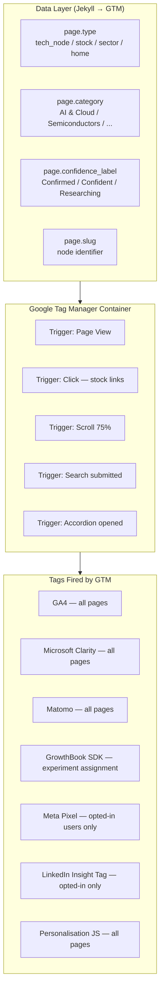
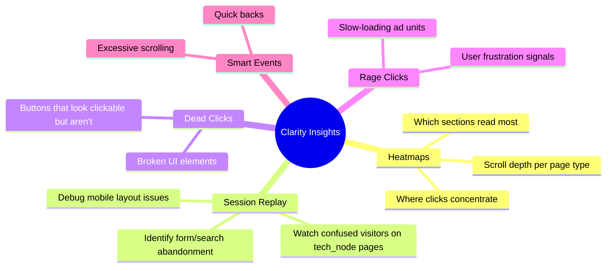
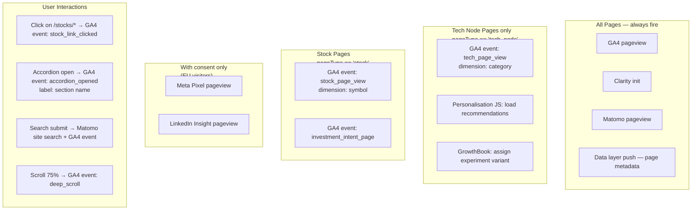

# Enhancement 15 — Tag Management & Free Measurement Tools

## Problem

Currently no tag management, no heatmap data, no session replay, and no visitor behaviour insight exists on the platform. Adding analytics, ad pixels, A/B test SDKs, and personalisation scripts individually to Jekyll templates creates unmaintainable tag sprawl — every new tracking requirement requires a code change and a deployment. A tag management system (TMS) centralises all third-party scripts, enables non-developer activation of tracking, and provides a single governance point for privacy compliance.

**All tools in this enhancement are genuinely free** — not freemium with critical features paywalled.

---

## Full-Scale Vision

Google Tag Manager as the universal tag container across all platform properties. A curated stack of free measurement and insight tools — Microsoft Clarity, Google Search Console, Bing Webmaster Tools, and others — layered under GTM. All firing rules governed by a data layer specification, not hard-coded conditionals.



---

## Data Layer Specification

Every Jekyll page must push a standard data layer object before GTM fires. This decouples measurement logic from template logic:

```javascript
// In _layouts/default.html — before </head>
window.dataLayer = window.dataLayer || [];
window.dataLayer.push({
  'event': 'pageMetadata',
  'page': {
    'type': '{{ layout.name }}',                    // 'tech_node', 'stock', 'sector', 'home'
    'slug': '{{ page.slug | default: page.url }}',
    'category': '{{ page.category | default: "" }}',
    'confidenceLabel': '{{ page.confidence_label | default: "" }}',
    'horizon': '{{ page.horizon | default: "" }}',
    'estYear': {{ page.est_year | default: 'null' }},
    'sourceCount': {{ page.source_count | default: 0 }},
    'stocks': {{ page.stocks | jsonify | default: '[]' }}
  }
});
```

GTM variables then reference `{{DL - page.type}}`, `{{DL - page.category}}` etc. — no hard-coded values in GTM.

---

## Tool Stack — Genuinely Free

| Tool | Purpose | Cost | Data Retained By |
|------|---------|------|-----------------|
| Google Tag Manager | Tag container, all firing rules | Free | We control |
| Google Analytics 4 | Acquisition, conversion, audiences | Free | Google |
| Microsoft Clarity | Heatmaps, session replay, scroll maps | Free | Microsoft |
| Google Search Console | Search rankings, impressions, AIO | Free | Google |
| Bing Webmaster Tools | Bing search performance | Free | Microsoft |
| Matomo (self-hosted) | Privacy-first analytics | Free (self-host) | We control |
| GrowthBook OSS | Feature flags + A/B testing | Free (self-host) | We control |
| Google PageSpeed Insights | Core Web Vitals, performance | Free | Google |
| Hotjar Basic | Heatmaps (500 sessions/month) | Free tier | Hotjar |
| Plausible Community | Open-source analytics (alt to Matomo) | Free (self-host) | We control |
| Lighthouse CI | Automated performance audits in CI/CD | Free | We control |

---

## Microsoft Clarity — Setup and Use

Clarity provides heatmaps, session recordings, and dead-click detection at zero cost, with no session or page view limits. Critical for understanding UX without paid tools:

```javascript
// GTM Custom HTML tag — Microsoft Clarity
(function(c,l,a,r,i,t,y){
    c[a]=c[a]||function(){(c[a].q=c[a].q||[]).push(arguments)};
    t=l.createElement(r);t.async=1;t.src="https://www.clarity.ms/tag/"+i;
    y=l.getElementsByTagName(r)[0];y.parentNode.insertBefore(t,y);
})(window, document, "clarity", "script", "YOUR_PROJECT_ID");
```

**GTM trigger:** Fire on all pages. **Exclude:** Admin/preview environments (GTM environment variable: `{{ENV}} != production`).

### Clarity insights to use:



---

## GTM Firing Rules — Complete Tag Plan



---

## Bing Webmaster Tools

Often overlooked, Bing Webmaster Tools is free and provides:
- **Keyword research tool** — free keyword volume data (alternative to Google Keyword Planner)
- **Backlink data** — free backlink report
- **URL submission** — instant indexing requests
- **Site scan** — technical SEO audit

```bash
# Submit sitemap to Bing
curl -X GET "https://www.bing.com/webmaster/ping.aspx?siteMap=https://futuretrends.io/sitemap.xml"
```

---

## Lighthouse CI — Automated Performance Audits

Run Lighthouse on every GitHub Actions deploy to catch Core Web Vitals regressions before they hit production:

```yaml
# .github/workflows/lighthouse.yml
- name: Run Lighthouse CI
  uses: treosh/lighthouse-ci-action@v10
  with:
    urls: |
      https://staging.futuretrends.io/
      https://staging.futuretrends.io/tech/solid-state-batteries/
    budgetPath: ./lighthouse-budget.json
    uploadArtifacts: true

# lighthouse-budget.json
{
  "budgets": [{
    "resourceSizes": [{"resourceType": "total", "budget": 500}],
    "timings": [{"metric": "first-contentful-paint", "budget": 2000},
                {"metric": "largest-contentful-paint", "budget": 2500}]
  }]
}
```

---

## Privacy Compliance via Consent Mode

For EU visitors, GTM Consent Mode v2 ensures tags only fire after consent is given:

```javascript
// Consent Mode defaults (conservative — deny all until consent)
window.dataLayer.push({
  'consent': 'default',
  'ad_storage': 'denied',
  'analytics_storage': 'denied',
  'wait_for_update': 500
});

// After consent granted (via cookie banner)
window.dataLayer.push({
  'event': 'consent_update',
  'consent': 'update',
  'ad_storage': 'granted',
  'analytics_storage': 'granted'
});
```

Matomo with cookie-free mode fires without any consent requirement — it collects no PII and uses no cookies. GA4 and Meta/LinkedIn pixels require consent in the EU.

---

## Phased Implementation

| Phase | Deliverable | Effort |
|-------|-------------|--------|
| 1 | GTM container created + Jekyll snippet injected | 1 day |
| 2 | Data layer specification + Jekyll push on all layouts | 2 days |
| 3 | GA4 tag + core events in GTM | 1 day |
| 4 | Microsoft Clarity tag + project created | 1 day |
| 5 | Matomo tag in GTM | 1 day |
| 6 | GSC + Bing Webmaster Tools verified | 1 day |
| 7 | GrowthBook SDK tag in GTM | 1 day |
| 8 | Consent Mode v2 for EU compliance | 2 days |
| 9 | Lighthouse CI in GitHub Actions | 1 day |
| 10 | All interaction triggers (clicks, scroll, search) | 2 days |

---

## Success Metrics

| Metric | Baseline | 30-Day Target |
|--------|----------|---------------|
| GTM container live | No | Yes |
| Tags managed via GTM | 0 | 5+ |
| Clarity session recordings available | 0 | 100+ |
| Data layer pushes per page type | 0 | 3 types covered |
| Lighthouse CI blocking on LCP > 2.5s | No | Yes |
| GSC + Bing verified | No | Both verified |
| Consent Mode v2 active | No | Yes |

---

## Open Questions

- Should GTM also manage the ad server pixel, or is that handled directly by the ad server? Ad server impression/click tracking fires server-side — GTM is not needed there. GTM handles client-side visibility (viewability) signals only.
- Hotjar Basic (500 sessions/month) vs Microsoft Clarity (unlimited) — Clarity wins outright, but Hotjar has better funnel visualisation. Use Clarity as the primary; evaluate Hotjar for specific funnel analysis phases only.
- Is there a performance cost to loading GTM + GA4 + Clarity + Matomo + GrowthBook simultaneously? Yes: ~80–120KB extra, ~100–200ms parse time on mobile. Mitigate via: defer attribute on GTM, Clarity loaded after first user interaction, Matomo async. Monitor via Lighthouse CI.
