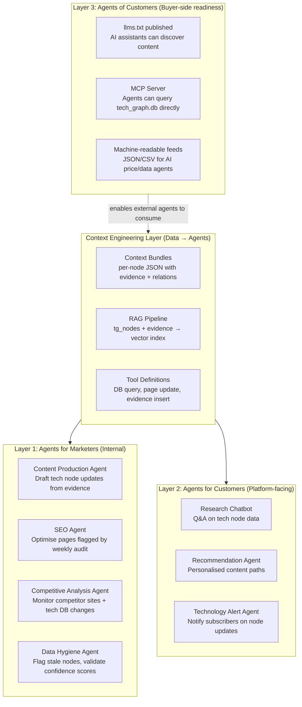
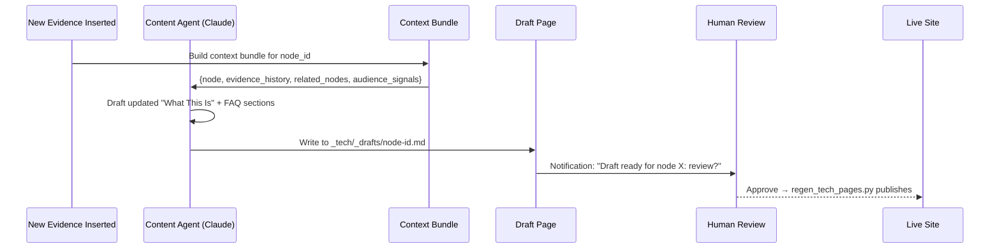
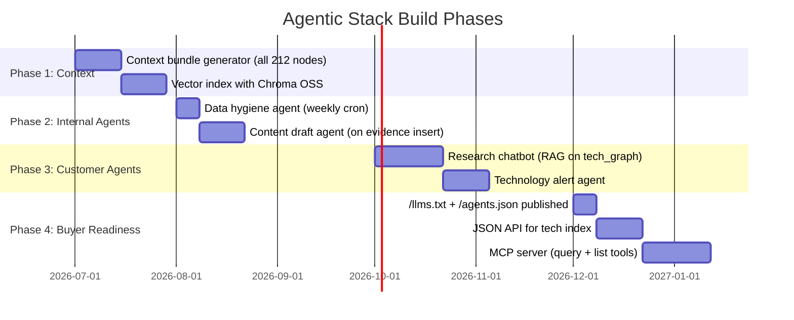

# Enhancement 16: Agentic Martech Stack

## Problem

The Martech for 2026 report (chiefmartec / MartechTribe, Dec 2025) identifies a fundamental shift: **90.3% of marketing organisations are using AI agents**, yet most are still in the experimental phase. The three domains of AI agents: *Agents for Marketers* (internal), *Agents for Customers* (customer-facing), and *Agents of Customers* (buyer-side): are all reshaping how the platform must operate. Currently, the platform has zero agentic capabilities. Everything is manual or scheduled batch scripts.

**"AI is a commodity. Context is differentiation."**: The report identifies poor data quality (56.3% of organisations cite this as their #1 AI challenge) and context engineering: getting the right data to the right agent at the right time: as the real implementation challenge.

---

## Full-Scale Vision

A layered agentic stack built on top of the existing platform infrastructure. Each layer corresponds to one of the three agent domains from the report, implemented using open-source tools (Claude API, LangChain, n8n self-hosted) with the platform's `tech_graph.db` as the primary context source.



---

## Layer 1: Agents for Marketers

### Content Production Agent

Automatically drafts updated content for tech node pages when new evidence is inserted, reducing the manual regen step to a review-and-approve flow:



**Key pattern from the report:** Human-in-the-loop for review. The agent drafts; a human approves. 68.9% of organisations use content production agents this way.

### Data Hygiene Agent (Weekly Cron)

```python
# hygiene_agent.py: weekly run
# 1. Find nodes with src_count > 0 but no source_date in last 180 days → flag as stale
# 2. Find nodes where confidence changed >0.2 in last 30 days → flag for review
# 3. Find nodes with no edges → flag as orphaned
# 4. Generate hygiene report → write to _data/hygiene_report.json
# 5. Alert if > 5 stale nodes accumulate
```

---

## Layer 2: Agents for Customers

### Research Chatbot

A lightweight RAG chatbot that answers questions about tracked technologies using `tech_graph.db` as the knowledge base:

```mermaid
flowchart LR
    USER[Visitor question:\n"Which battery tech\nhas the highest confidence?"] --> EMBED[Embed query\nOpenAI / local sentence-transformers]
    EMBED --> VECTOR[Vector search\ntech_graph vector index\nchroma / qdrant OSS]
    VECTOR --> CONTEXT[Retrieve top-5 relevant nodes\nwith evidence + confidence]
    CONTEXT --> LLM[Claude API\ngenerate answer with citations]
    LLM --> RESPONSE[Response with source links\nto _tech/*.md pages]
```

**Free/low-cost stack:**
- Vector store: Chroma (self-hosted, free) or SQLite-VSS
- Embeddings: `sentence-transformers/all-MiniLM-L6-v2` (local, free)
- LLM: Claude API (pay-per-use) or Ollama + Mistral (free, local)

### Technology Alert Agent

Users subscribe to technology nodes. When evidence is inserted and confidence changes significantly, an alert is generated:

```python
# alert_agent.py
# Triggered after confidence_engine.add_evidence()
# If abs(new_conf - old_conf) > 0.15:
#   → draft 1-sentence plain-English summary of what changed and why
#   → queue for email/RSS notification to subscribers
```

---

## Layer 3: Agents of Customers (Buyer-Side Readiness)

The report identifies this as the most disruptive domain: AI assistants (ChatGPT, Claude, Gemini) acting as buyers' research agents, bypassing traditional content discovery. The platform must make itself accessible to these agents:

```mermaid
graph LR
    subgraph BuyerAgents["Buyer-Side AI Agents"]
        GPT_AGENT[ChatGPT browsing\nresearches technologies]
        CLAUDE_AGENT[Claude Projects\ncustom knowledge base]
        PERP_AGENT[Perplexity\ncites sources directly]
    end

    subgraph OurReadiness["Platform Readiness for Buyer Agents"]
        LLMSTXT_FILE[/llms.txt\nExplicit AI content map]
        AGENTS_JSON[/agents.json\nCapabilities declaration]
        JSON_FEEDS[/api/tech.json\nMachine-readable tech index]
        MCP[MCP Server\ntool: query_tech_node\ntool: list_technologies\ntool: get_evidence]
    end

    BuyerAgents -->|Discover + query| OurReadiness
```

**`/agents.json`**: emerging standard for declaring agent capabilities:
```json
{
  "name": "Future Trends Tech Intelligence",
  "description": "Evidence-based tracking of 212+ emerging technologies with deployment timelines and investment exposure.",
  "tools": [
    {
      "name": "get_tech_node",
      "description": "Get technology details including confidence score, deployment timeline, and stock exposure.",
      "endpoint": "https://futuretrends.io/api/tech/{node_id}"
    },
    {
      "name": "list_technologies",
      "description": "List all tracked technologies filtered by category, stage, or horizon.",
      "endpoint": "https://futuretrends.io/api/tech?category={category}&stage={stage}"
    }
  ]
}
```

---

## Context Engineering Architecture

The report's central thesis: context engineering: the pipeline from data to AI agent: is the real implementation challenge and the real competitive moat.

```mermaid
flowchart TD
    subgraph DataSources["Data Sources"]
        TECHDB[tech_graph.db\n212 nodes + 500+ edges]
        EVIDENCE[tg_node_confidence_log\n1,000+ evidence entries]
        STOCKDB[entity_stock.db\nstock exposure]
        ANALYTICS[analytics.db\nengagement signals]
    end

    subgraph ContextEngineering["Context Engineering Pipeline"]
        PRECOMP[Pre-compute context bundles\nnightly: all 212 nodes]
        EMBED[Build vector index\nnode descriptions + evidence]
        GRAPH_EMBED[Graph embeddings\nnode2vec on tg_edges]
        FRESHEN[Freshness check\nflag stale > 7 days]
    end

    subgraph AgentContext["Agent Context at Query Time"]
        RETRIEVAL[Hybrid retrieval:\nBM25 keyword + vector semantic\n+ graph traversal]
        RERANK[Reranker\n3-stage: coarse → fine → diversity]
        BUNDLE[Context bundle:\n{node, top-5 evidence, related_nodes,\nengagement, stocks}]
    end

    DataSources --> ContextEngineering
    ContextEngineering --> AgentContext
    AgentContext --> AGENT[AI Agent receives\nhigh-quality context]
```

---

## Phased Implementation



---

## Success Metrics

| Metric | Baseline | Target |
|--------|----------|--------|
| Internal agents deployed | 0 | 2 (hygiene + content draft) |
| Content drafts generated per week | 0 | 3–5 |
| Research chatbot questions answered | 0 | Live |
| /llms.txt + /agents.json published | No | Yes |
| MCP server tools available | 0 | 3 |
| AI agent citations (Perplexity/ChatGPT) | 0 baseline | +20/week |

---

## Open Questions

- n8n self-hosted (workflow automation, free OSS) vs custom Python scripts for agent orchestration: n8n is better for multi-step workflows with branching logic; Python scripts are better for data-heavy transformations. Use n8n for agent pipelines, Python for ETL.
- The report notes 17.5% of organisations now provide an MCP server. Is it premature to build one now? No: the effort is 1–2 weeks and the upside (being discoverable by AI agents) compounds with AEO/GEO strategies.
- LLM cost: Claude API at $3/million input tokens. A content draft agent running on 212 nodes weekly with ~2K token context bundles = ~$1.27/week. Negligible.
