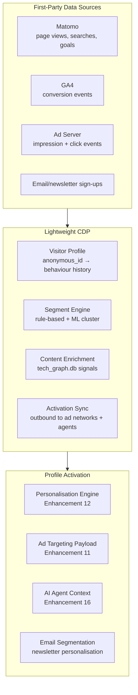
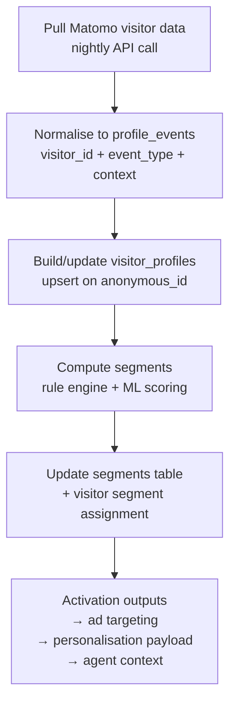
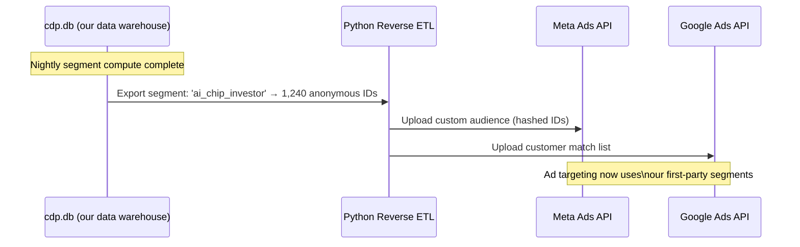

# Enhancement 17: Context Engineering & Customer Data Platform

## Problem

The Martech for 2026 report names **context engineering**: getting the right data to the right agent at the right time: as the defining challenge of agentic marketing. **56.3% of organisations cite poor data quality as their #1 AI implementation challenge.** The report frames the martech stack evolution as moving from *systems of record* → *systems of engagement* → *systems of knowledge* → *systems of context*.

The platform currently has no customer data platform (CDP) layer. Visitor data from Matomo lives in `matomo_db`. Technology data lives in `tech_graph.db`. Stock data lives in `entity_stock.db`. No unified profile exists for a visitor, and no context bundle assembles these sources into a coherent input for AI agents. This limits personalisation (Enhancement 12), experimentation (Enhancement 13), and the agentic stack (Enhancement 16).

---

## Full-Scale Vision

A lightweight, self-hosted CDP that unifies first-party behavioural data with content intelligence data to produce **visitor context profiles**: the input to personalisation, AI agents, and ad targeting. At platform scale, this CDP serves multiple properties and can be offered as a managed service to Martech platform clients.



---

## CDP Architecture: Self-Hosted, Zero License

No Segment, no RudderStack Cloud, no mParticle. Build with:

| Component | Tool | Cost |
|-----------|------|------|
| Event collection | Matomo + GA4 (via GTM) | Free |
| Profile storage | SQLite → `cdp.db` | Free |
| Segment computation | Python (nightly cron) | Free |
| Audience activation | Custom Python → ad network APIs | Free |
| Real-time enrichment | FastAPI microservice (future) | Free (self-hosted) |

**Why not RudderStack OSS?** RudderStack self-hosted requires Node.js + PostgreSQL + a complex Docker stack. Our CDP requirements are simpler: a SQLite schema and a Python compute layer is sufficient for current scale.

---

## Visitor Profile Schema

```sql
-- cdp.db schema

CREATE TABLE visitor_profiles (
    anonymous_id      TEXT PRIMARY KEY,          -- Matomo visitor ID (no PII)
    first_seen        DATETIME,
    last_seen         DATETIME,
    session_count     INTEGER DEFAULT 0,
    total_pageviews   INTEGER DEFAULT 0,
    segment           TEXT,                      -- investor / tech_researcher / marketer / general
    segment_confidence REAL,                     -- 0.0–1.0
    top_category      TEXT,                      -- most viewed tg_nodes.category
    top_nodes         TEXT,                      -- JSON: top 5 node_ids viewed
    search_terms      TEXT,                      -- JSON: search queries from Matomo
    stock_pages_viewed TEXT,                     -- JSON: tickers visited
    last_updated      DATETIME
);

CREATE TABLE profile_events (
    id              INTEGER PRIMARY KEY AUTOINCREMENT,
    anonymous_id    TEXT REFERENCES visitor_profiles(anonymous_id),
    event_type      TEXT,                        -- page_view / search / stock_click / ad_click
    node_id         TEXT,                        -- if page_view on a tech node
    ticker          TEXT,                        -- if stock page viewed
    value           TEXT,                        -- event-specific payload (JSON)
    created_at      DATETIME DEFAULT CURRENT_TIMESTAMP
);

CREATE TABLE segments (
    name            TEXT PRIMARY KEY,
    description     TEXT,
    rule_json       TEXT,                        -- segment definition as JSON rules
    visitor_count   INTEGER,
    last_computed   DATETIME
);
```

---

## Segment Computation Pipeline



### Rule-Based Segments (Deterministic)

```python
SEGMENT_RULES = {
    "investor": {
        "min_stock_pages_viewed": 2,
        "OR": [
            {"search_contains": ["stock", "invest", "ticker", "portfolio"]},
            {"top_category": ["AI & Cloud", "Semiconductors"]}
        ]
    },
    "ai_chip_researcher": {
        "top_category_IN": ["AI & Cloud", "Semiconductors"],
        "min_pageviews": 5,
        "min_session_count": 2
    },
    "martech_buyer": {
        "OR": [
            {"search_contains": ["martech", "CRM", "CDP", "marketing tool"]},
            {"referrer_contains": ["linkedin.com"]}
        ]
    }
}
```

---

## Context Bundle for AI Agents

The CDP's primary output is a context bundle that AI agents (Enhancement 16) consume:

```mermaid
graph LR
    PROFILE[visitor_profile\n{segment, top_nodes, searches}] --> BUNDLE
    TECH_GRAPH[tech_graph.db\n{node details, edges, confidence}] --> BUNDLE
    ANALYTICS[Recent analytics\n{trending pages this week}] --> BUNDLE
    STOCK[Stock exposure\n{tickers linked to interests}] --> BUNDLE

    BUNDLE[Context Bundle\n{visitor_segment,\n recommended_nodes: [],\n investment_tickers: [],\n content_gaps: [],\n trending_this_week: []}]

    BUNDLE --> AGENT[AI Agent\nuses context for\npersonalised response]
    BUNDLE --> PERSONAL[Personalisation Engine]
    BUNDLE --> ADS[Ad Targeting]
```

---

## CDP Maturity Model

```mermaid
quadrantChart
    title CDP Maturity vs Implementation Complexity
    x-axis Low Complexity --> High Complexity
    y-axis Basic Capability --> Advanced Capability
    quadrant-1 Platform Goal (Phase 3)
    quadrant-2 Future (Phase 4+)
    quadrant-3 Start Here (Phase 1)
    quadrant-4 Avoid (premature complexity)
    Anonymous session tracking: [0.15, 0.20]
    Rule-based segmentation: [0.25, 0.40]
    Cross-session profile stitching: [0.40, 0.55]
    ML-based segment scoring: [0.55, 0.65]
    Real-time profile API: [0.65, 0.75]
    Identity resolution: [0.80, 0.85]
    Predictive LTV scoring: [0.85, 0.90]
```

---

## Integration with GrowthLoop / Hightouch Pattern

The report highlights GrowthLoop and Hightouch as leading agentic CDP tools. Our self-built CDP mirrors their core pattern (Reverse ETL) at zero cost:



---

## Phased Implementation

| Phase | Deliverable | Effort |
|-------|-------------|--------|
| 1 | `cdp.db` schema + Matomo event pull | 1 week |
| 2 | Visitor profile builder (nightly cron) | 1 week |
| 3 | Rule-based segment engine (6 segments) | 1 week |
| 4 | Context bundle generator per segment | 1 week |
| 5 | Segment activation → personalisation engine | 1 week |
| 6 | Reverse ETL → Meta + Google Ads APIs | 1 week |
| 7 | ML segment scoring (logistic regression) | 2 weeks |
| 8 | Real-time profile API (FastAPI) | 2 weeks |

---

## Success Metrics

| Metric | Baseline | 6-Month Target |
|--------|----------|----------------|
| Visitor profiles in CDP | 0 | All tracked visitors |
| Segments computed | 0 | 6 |
| Segment coverage (% of visitors profiled) | 0% | >60% |
| Context bundles available per segment | 0 | 6 |
| Ad audience segments activated | 0 | 2 (Meta + Google) |
| Personalisation lift attributable to CDP | N/A | >15% pages/session |

---

## Open Questions

- GDPR: anonymous IDs from Matomo (cookie-free): are these personal data under GDPR? Regulators are debating this; using a rotating hash with no cross-site tracking and no PII linkage is the safest approach.
- At what point does the self-built CDP justify migrating to RudderStack OSS? When the number of activation destinations exceeds 5, or when real-time (sub-second) profile updates are needed.
- Should the CDP feed a newsletter personalisation layer? Yes: segment-aware weekly digest emails are high-ROI. Add as a Phase 8 sub-feature once the subscriber list grows beyond 100.
