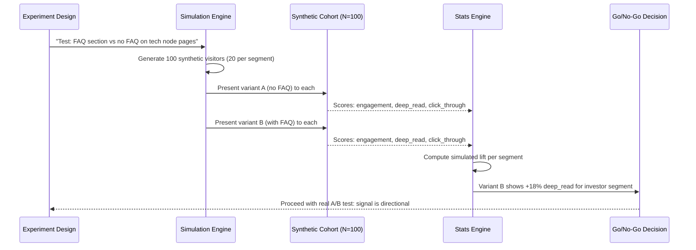
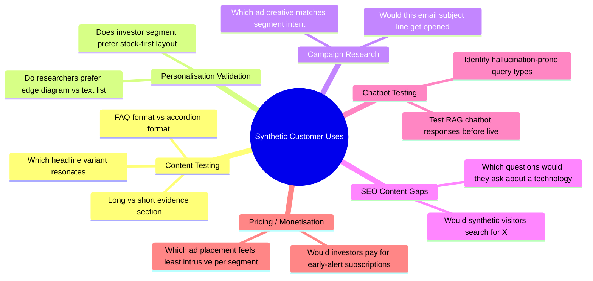
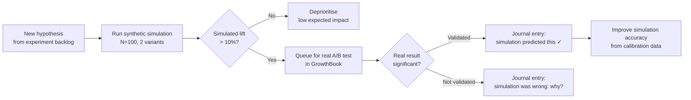

# Enhancement 18: Synthetic Customer Simulation & Digital Twins

## Problem

Testing personalisation (Enhancement 12) and experiments (Enhancement 13) on real visitors introduces risk: every poorly-conceived test erodes user trust and degrades metrics before data accumulates. The Martech for 2026 report identifies **synthetic customers** (also called digital twins or simulated audiences) as an emerging martech category, used to test campaigns and content hypotheses with zero risk to real users before deployment.

> *"You can test new campaigns and run market research studies with these simulants. You can talk to any arbitrary segment of them to ask questions about their interests and behaviours... with no risk of offending them."*: Martech for 2026

Real-world tools (Brox, Panoplai, Evidenza) cost thousands per month. The core technique is accessible with an LLM API and the platform's own first-party data.

---

## Full-Scale Vision

A Python-based synthetic customer simulation layer that generates synthetic visitor cohorts from the platform's CDP segments (Enhancement 17), uses them to pre-test content variants and personalisation hypotheses, and produces directional signal on which experiments are worth running on real traffic.

```mermaid
graph TD
    subgraph Build["Build Synthetic Cohorts"]
        REAL_DATA[Real CDP segments\nbehavioural patterns + interests]
        PERSONA[Persona definitions\nInvestor / Tech Researcher / Marketer]
        LLM[LLM Agent (Claude)\ninstantiate N synthetic visitors]
        COHORT[(Synthetic cohort\nN=100 per segment)]
    end

    subgraph Test["Run Simulated Experiments"]
        CONTENT[Content variant A or B\n_tech/*.md or homepage hero]
        SIMULATE[Simulate: Would this visitor\nengage, click through, convert?]
        SCORE[Score: engagement probability\nper variant per cohort]
        COMPARE[Compare variant scores\nacross all cohorts]
    end

    subgraph Output["Pre-Test Outputs"]
        SIGNAL[Directional signal:\nVariant B likely +20% engagement for investors]
        SKIP[Skip: both variants score the same\n→ low-priority experiment]
        PRIORITISE[Prioritise: variant shows\n>15% uplift in simulation → run real test]
    end

    Build --> Test --> Output
```

---

## Synthetic Persona Construction

Each synthetic visitor is constructed from: (1) the segment's behavioural archetype, (2) real aggregate patterns from the CDP, and (3) LLM-generated personality and context:

```python
# synthetic_customer.py

PERSONA_TEMPLATES = {
    "investor": {
        "role": "Retail investor, 35–50, actively manages a tech-heavy portfolio",
        "goal": "Identify technologies before they become investable catalysts",
        "pain_points": ["too much hype, not enough evidence", "hard to track deployment timelines"],
        "content_preference": "concise, evidence-backed, actionable",
        "avg_session_depth": 3.2,
        "typical_queries": ["battery stocks 2026", "AI infrastructure investment thesis"],
    },
    "tech_researcher": {
        "role": "Engineer or product manager at a tech company",
        "goal": "Understand technical feasibility and timelines for planning purposes",
        "pain_points": ["surface-level content without technical depth", "no timeline reliability"],
        "content_preference": "technical precision, cited sources, edge relationships",
        "avg_session_depth": 5.1,
        "typical_queries": ["solid electrolyte manufacturing challenges", "inference scaling bottlenecks"],
    }
}

def generate_synthetic_visitor(segment: str, variation_seed: int) -> dict:
    """Use LLM to generate a unique synthetic visitor within segment archetype."""
    base = PERSONA_TEMPLATES[segment]
    # Inject demographic and behavioural variation via LLM
    # Returns: {persona, viewing_priorities, engagement_thresholds, conversion_triggers}
    ...
```

---

## Simulated Content Evaluation

Present each synthetic visitor with a content variant and ask the LLM to score engagement:

```python
# simulate_experiment.py

def evaluate_content_variant(synthetic_visitor: dict, page_content: str, variant_name: str) -> dict:
    prompt = f"""
You are a synthetic research visitor with these characteristics:
{json.dumps(synthetic_visitor, indent=2)}

You have just landed on this webpage:
---
{page_content[:2000]}
---

Rate your likely behaviour on a 0–10 scale for each dimension:
1. Immediate engagement (do you read past the first paragraph?)
2. Deep engagement (do you read the full page?)
3. Click-through (do you click an internal link to a related page?)
4. Return intent (would you bookmark or return to this site?)
5. Conversion intent (would you sign up for alerts, click an ad, or share?)

Respond as JSON: {{"engagement": N, "deep_read": N, "click_through": N, "return": N, "conversion": N, "reasoning": "..."}}
"""
    response = claude_client.messages.create(
        model="claude-haiku-4-5-20251001",  # cheap model for simulation
        max_tokens=300,
        messages=[{"role": "user", "content": prompt}]
    )
    return json.loads(response.content[0].text)
```

---

## Simulation Workflow



---

## Use Cases Beyond A/B Testing



---

## Cost Model

Using Claude Haiku (cheapest) for simulation keeps costs negligible:

| Scale | Cost Estimate |
|-------|--------------|
| 100 synthetic visitors, 2 variants, 1 experiment | ~$0.02 |
| 5 experiments per week | ~$0.10/week |
| Monthly simulation budget | ~$0.50 |

---

## Integration with Experimentation Pipeline



Over time, the simulation engine is calibrated against real A/B results, improving prediction accuracy.

---

## Phased Implementation

| Phase | Deliverable | Effort |
|-------|-------------|--------|
| 1 | Persona templates for 5 segments | 2 days |
| 2 | `generate_synthetic_visitor()` using Claude API | 3 days |
| 3 | `evaluate_content_variant()` scoring function | 3 days |
| 4 | Simulation run script (100 visitors, 2 variants) | 3 days |
| 5 | Integration with experiment backlog pipeline | 1 week |
| 6 | Calibration loop (compare predictions vs real results) | 2 weeks |
| 7 | Chatbot testing harness | 1 week |

---

## Success Metrics

| Metric | Baseline | 6-Month Target |
|--------|----------|----------------|
| Simulation engine operational | No | Yes |
| Experiments pre-screened by simulation | 0 | 100% of new experiments |
| Simulation prediction accuracy | N/A (no baseline) | Direction correct >65% |
| Cost per simulation run | N/A | <$0.05 |
| Wasted real-traffic experiments (no signal) | Unknown | Reduced by >50% |

---

## Open Questions

- LLM-based synthetic visitors are fundamentally non-deterministic. How do we get stable results? Run 100+ visitors and use the mean score: law of large numbers smooths variance.
- Is this approach valid for real product decisions, or is it just directional signal? Directional only: never use simulation results as a substitute for real A/B data. Use them to prioritise the experiment queue.
- At platform scale, should the synthetic customer library be shared across properties (Future Trends + Martech Directory)? Yes: a shared cohort library with property-specific behavioural overlays is the right model.
