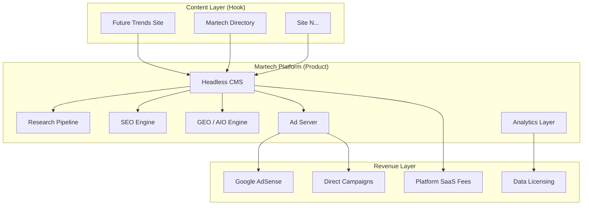

# Enhancements: Martech Platform Roadmap

> **Scope: Full platform, not just this site.**
> The Future Trends site (`mengliang10.github.io/future`) is the hook: a live proof of concept demonstrating programmatic content at scale. Every enhancement here must be architected for a multi-property, multi-tenant Martech platform that will eventually serve many sites, clients, and verticals.

---

## Why This Matters

The content we publish is the bait. The platform we build is the product.

The Future Trends site proves the pipeline: research → DB → automated page generation → publish → monetize. That same pipeline, hardened and scaled, is the foundation of a Martech SaaS platform. Every architectural decision made here: CMS choice, SEO tooling, ad infrastructure: should be evaluated through two lenses simultaneously:

| Lens | Question |
|------|----------|
| **Site lens** | Does this work for Future Trends today? |
| **Platform lens** | Can this serve 50 properties, 10 clients, or be resold as a service? |

If an enhancement only passes the site lens, it is a local fix, not an investment. Prioritize enhancements that pass both.

---

## Enhancement Index

| # | File | Theme | Status |
|---|------|-------|--------|
| 1 | [01-cms-overhaul.md](01-cms-overhaul.md) | Replace Jenkins/manual with headless CMS | Draft |
| 2 | [02-seo-stack.md](02-seo-stack.md) | SEO without SemRush: open-source + API stack | Draft |
| 3 | [03-geo-strategy.md](03-geo-strategy.md) | Generative Engine Optimization for AI search | Draft |
| 4 | [04-aio-optimization.md](04-aio-optimization.md) | AI Overview (Google AIO) optimization | Draft |
| 5 | [05-martech-consolidation.md](05-martech-consolidation.md) | Merge Martech project into unified platform | Draft |
| 6 | [06-domain-migration.md](06-domain-migration.md) | Migrate from GitHub Pages to owned domain | Draft |
| 7 | [07-monetize-adsense.md](07-monetize-adsense.md) | Google AdSense integration | Draft |
| 8 | [08-monetize-adserver.md](08-monetize-adserver.md) | Build and operate a first-party ad server | Draft |
| 9 | [09-analytics-tracking.md](09-analytics-tracking.md) | GA4 + Matomo dual-layer analytics: no paid tools | Draft |
| 10 | [10-data-strategy.md](10-data-strategy.md) | Data lake, data mesh, ETL pipeline, context engineering | Draft |
| 11 | [11-ad-network-management.md](11-ad-network-management.md) | Google/Meta/LinkedIn Ads management + unified attribution | Draft |
| 12 | [12-personalization.md](12-personalization.md) | Behavioural personalisation: no paid tools | Draft |
| 13 | [13-experimentation-testing.md](13-experimentation-testing.md) | A/B, MVT, holdouts, experiment journal: GrowthBook OSS | Draft |
| 14 | [14-social-listening.md](14-social-listening.md) | Social listening via Reddit/HN/RSS: no paid tools | Draft |
| 15 | [15-tag-management-free-tools.md](15-tag-management-free-tools.md) | GTM, Microsoft Clarity, Lighthouse CI, free tool stack | Draft |
| 16 | [16-agentic-martech-stack.md](16-agentic-martech-stack.md) | AI agents for marketers + customers + buyer-side readiness | Draft |
| 17 | [17-context-engineering-cdp.md](17-context-engineering-cdp.md) | Self-hosted CDP + context engineering for AI agents | Draft |
| 18 | [18-synthetic-customers-simulation.md](18-synthetic-customers-simulation.md) | Synthetic customer digital twins for pre-testing | Draft |

---

## Platform Vision



---

## Design Principles for Every Enhancement

1. **API-first**: every component exposes an interface; nothing is wired together by hand.
2. **Multi-tenancy from day one**: even if only one tenant exists today, the data model must support N.
3. **Open-source preferred**: proprietary SaaS tools create lock-in and margin leakage; replace them where credible OSS alternatives exist.
4. **Measurable**: every enhancement has a metric that proves it is working.
5. **Incremental**: each enhancement ships in phases; no big-bang rewrites.

---

## How to Add a New Enhancement

1. Copy the template below into a new file: `NN-short-name.md`
2. Fill in: problem statement, full-scale vision, phased implementation, mermaid diagrams, success metrics.
3. Add a row to the index table above.
4. Link from `DEVELOPMENT.md` in the Martech project if implementation has started.

```markdown
# Enhancement NN: Title

## Problem
## Full-Scale Vision
## Current State
## Phased Implementation
## Architecture Diagram (mermaid)
## Success Metrics
## Open Questions
```
