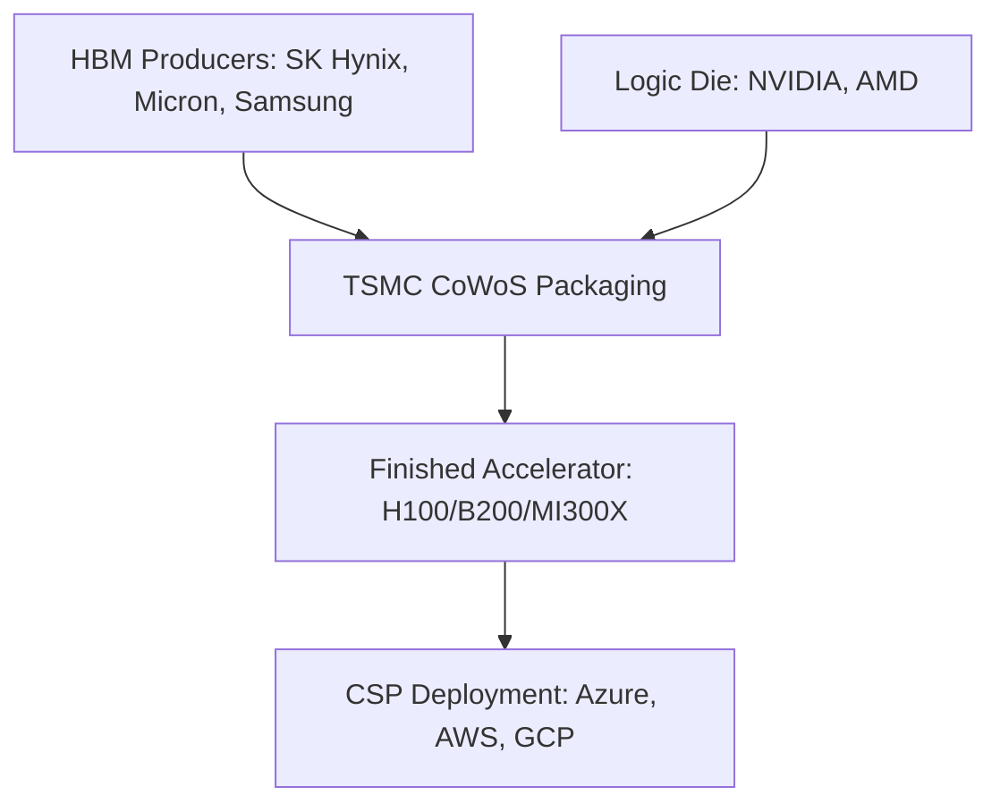

# Accelerator & HBM: The Memory Wall Crisis

High Bandwidth Memory (HBM) has shifted from a peripheral component to the primary bottleneck in AI scaling. As compute performance scales with Blackwell and MI350, the "Memory Wall"—the latency gap between processor speed and data retrieval—defines the winner of the AI supercycle.

## 1. Supply Chain Architecture

## 2. Fundamental Analysis (Trading Indicators)

| Factor | Status | Impact on Stock |
| :--- | :--- | :--- |
| **HBM3E Yields** | ⚠️ Critical | Low yields at Samsung create pricing power for SK Hynix (High alpha). |
| **TSMC CoWoS-S Capacity** | ✅ Expanding | Benefit to WFE players like BESI and Camtek. |
| **Die Stacking Height** | 📈 Increasing | Shift from 8-hi to 12-hi stacks increases ASP by ~30%. |

## 3. Price Action & Technical Outlook

*   **SK Hynix:** Testing all-time highs as the primary HBM3E supplier for NVIDIA. Support at the 50-day SMA is a "buy the dip" trigger.
*   **Micron (MU):** Catching up with 12-hi HBM3E certifications. Watch for a breakout above recent consolidation resistance on volume.
*   **Samsung:** Trading at a "laggard discount." Certification by NVIDIA for HBM3E is the binary catalyst needed for a 20%+ reversal.

## 4. Integrated Trading Thesis
Long **SK Hynix** and **Micron** on any 5-10% pullback. The structural shortage of HBM is expected to persist through 2026, creating a high-floor for earnings despite cyclical memory concerns.

---
*Last Updated: {{ site.time | date: "%B %-d, %Y" }}*
