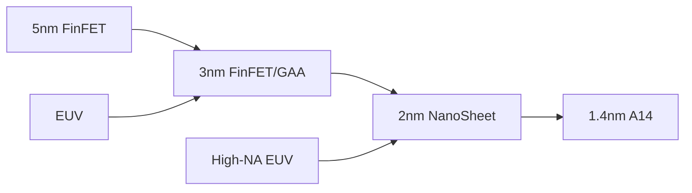

# Foundry Industry & WFE Yield Dynamics

The transition to 2nm (GAAFET) and High-NA EUV is the most expensive technical hurdle in history. Foundries (TSMC, Samsung, Intel) are no longer competing on price, but on **Wafer Yield**.

## 1. The Scaling Roadmap

## 2. Fundamental Analysis

| Equipment Category | Key Player | Moat Analysis |
| :--- | :--- | :--- |
| **Lithography** | ASML | 100% monopoly on High-NA EUV. Essential for <2nm. |
| **Deposition/Etch** | LAM Research | Critical for high-aspect ratio HBM holes (TSVs). |
| **Inspection** | KLAC | Yield-improving diagnostics. High margin, recurring revenue. |

## 3. Technical Trading Outlook

*   **TSMC (TSM):** The "Safe Haven" of the foundry world. Trading at a premium to its 50-day SMA. High-conviction hold as long as Apple and NVIDIA remain on the cutting edge.
*   **Intel (INTC):** Deep turnaround play. Success depends on the 18A node yields. Watch for "Foundry Client" announcements as a price trigger.
*   **ASML:** High volatility. Sensitive to China export controls. Technical support at the multi-year trendline.

## 4. Causal Narrative
The complexity of advanced packaging (CoWoS/SoIC) is forcing a convergence between **Foundries** and **OSATs**. Total addressable market (TAM) for WFE is shifting from logic into **Packaging Equipment**.

---
*Last Updated: {{ site.time | date: "%B %-d, %Y" }}*
