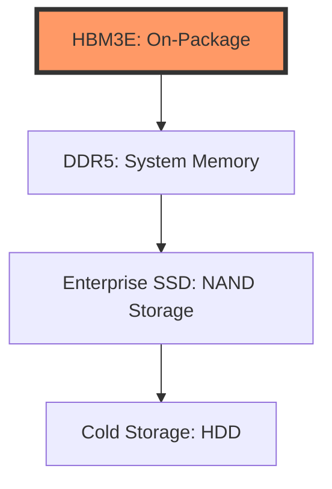

# Memory & Storage: Beyond the AI Hype

While HBM dominates the headlines, the broader memory market (DDR5, NAND) is undergoing a structural shift driven by the "Data Gravity" of AI clusters. As model weights grow, the speed of storage (SSD) and capacity of system memory become secondary and tertiary bottlenecks.

## 1. The Memory Hierarchy

## 2. Fundamental Analysis

*   **DDR5 Transition:** The shift from DDR4 to DDR5 is a high-margin event for **Western Digital (WDC)** and **Seagate (STX)**. AI servers require 4x the memory capacity of traditional servers.
*   **Enterprise NAND:** High-density QLC NAND is replacing traditional hard drives in the data center. **Micron (MU)** is the pure-play beneficiary.
*   **Cyclicality vs. Structural Growth:** The memory market is historically cyclical, but AI-driven demand is creating a "higher floor" for trough pricing.

## 3. Technical Strategy

*   **Micron (MU):** Watch the inventory levels. When inventory peaks and begins to decline, that is the generational buy signal.
*   **Western Digital (WDC):** The split between HDD and Flash businesses is a significant value-unlock catalyst.

## 4. Integrated Outlook
Long **MU** for performance-led growth and **WDC** for special-situation value. Memory is the "fuel" for the AI engine; without it, the compute layers stall.

---
*Last Updated: {{ site.time | date: "%B %-d, %Y" }}*
