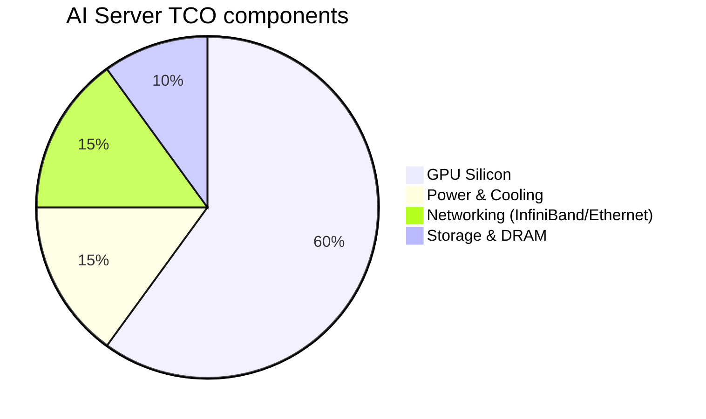

# AI Cloud TCO: Solving for $ Per Token

For Hyperscalers (AWS, Azure, GCP), the transition from General Purpose Compute to AI Factories is a CapEx arms race. Total Cost of Ownership (TCO) is the only metric that matters for long-term margin preservation.

## 1. TCO Breakdown (GPU vs. Systems)

## 2. Fundamental Analysis

*   **Power Density:** As racks move from 15kW to 100kW+ (GB200 NVL72), cooling becomes a specialized industrial moat (Vertiv, Eaton).
*   **Utilization Rates:** CSPs are shifting toward "Inference-First" architectures to increase monetization frequency vs. long training runs.
*   **Blackwell Economics:** NVIDIA's GB200 provides a 25x reduction in TCO compared to H100 for large-scale LLM inference.

## 3. Technical & Pricing Outlook

*   **Hyperscaler CapEx:** Meta and MSFT have signaled "uncapped" AI spending. Any dip in their share price due to high CapEx is a buying opportunity for the **Hardware Layer (NVDA, VRT, ANET)**.
*   **Vertiv (VRT):** Currently in a vertical parabolic run. Support is found at the 20-day EMA. The "Cooling Moat" is the primary tailwind.

## 4. The "AI Factory" Strategy
Monitor the spread between **NVIDIA's supply** and **Cloud Demand**. If Lead times drop below 12 weeks, rotate from Hardware into the **Software Layer** that is actually deploying these models.

---
*Last Updated: {{ site.time | date: "%B %-d, %Y" }}*
