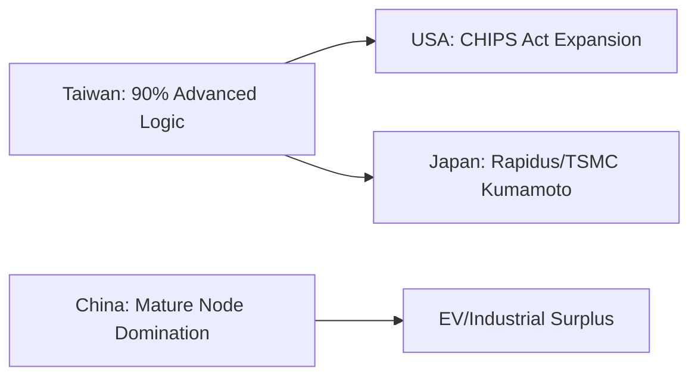

# Fab Maps & ClusterMAX: Geopolitical Capacity Tracking

Where chips are made is as important as how they are made. "Fab Maps" tracks the global geographical shift from Asia to the "Arizona/Texas" corridor (Silicon Desert).

## 1. Global Capacity Heatmap

## 2. Regional Breakdown & Stocks

*   **Arizona (TSM, INTC):** The US AI Hub. Beneficiaries: Local utilities and infrastructure partners.
*   **Kumamoto (Japan):** Sony/TSMC partnership. Massive tailwind for Japanese semi-suppliers (Tokyo Electron, Screen).
*   **Samsung (Pyeongtaek):** Massive multi-fab site. High technical risk but high capacity potential.

## 3. Technical Outlook
Track **TSM** and **Rapidus** construction progress. Any "On-Schedule" milestone is a fundamental "De-risking" event for the supply chain.

---
*Last Updated: {{ site.time | date: "%B %-d, %Y" }}*
