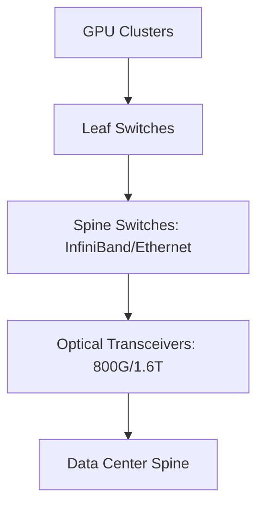

# AI Networking: The InfiniBand vs. Ethernet War

As clusters scale from 8k to 100k+ GPUs, networking becomes the "AI Backplane." The ability to move data across the cluster without latency (tail-latency) is the primary constraint on training speed.

## 1. Infrastructure Topology

## 2. Fundamental Analysis

*   **Arista Networks (ANET):** Leader in AI-Ethernet. Gaining share as "Ultra Ethernet Consortium" standards mature.
*   **NVIDIA (Mellanox):** Deep InfiniBand moat. Tightly coupled with the GPU stack. 
*   **Optical Pluggables:** Shift to **LPO (Linear Drive)** and **CPO (Co-Packaged Optics)** to reduce power by 30%. High alpha for small-cap optics players.

## 3. Technical Levels

*   **ANET:** Strong momentum. Support at $380 level. Target $450 on AI-Ethernet adoption.
*   **Broadcom (AVGO):** The "Switch Silicon" king. Trading in a massive multi-month base. Breakout above previous high targets significant upside.

## 4. Trading Narrative
Networking is a **Leading Indicator** for GPU build-outs. Watch switch orders to predict the next quarter's GPU revenue.

---
*Last Updated: {{ site.time | date: "%B %-d, %Y" }}*
